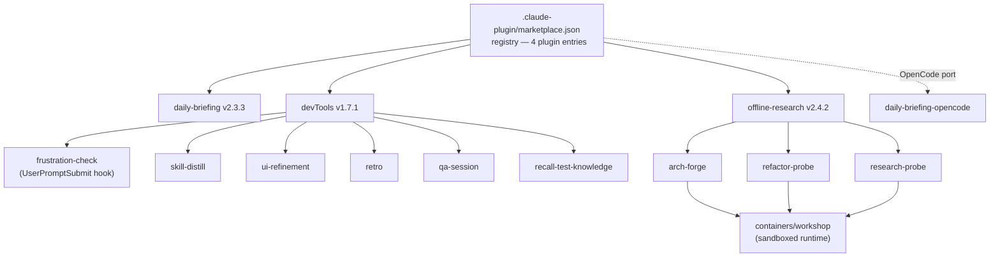

# ccToolBox

I built these because Claude Code didn't quite do what I needed. The drift never
got noticed. The UI loop needed a person in the chair. Long research runs expired
mid-flight. Working sessions that produced great patterns were thrown away.

Four tools address those four gaps: `frustration-check` (drift detection),
`offline-research` (container-isolated multi-hour loops), `skill-distill`
(promote sessions into reusable skills), `ui-refinement` (autonomous UI loop
with parallel critique passes). The others (daily-briefing, retro, qa-session,
recall-test-knowledge) are productive but less unusual.

```bash
claude plugins marketplace add github:dev32-io/ccToolBox
claude plugins install devTools@ccToolBox
```

## Architecture



## Crown jewels

### `frustration-check`: drift detection in real time

Claude Code treats every prompt the same. When I'd said the same thing three
times and Claude was still missing the point, nothing in the runtime noticed.
I'd catch myself mid-session typing "I already told you" and realize I'd spent
40 minutes going in circles on a premise I'd silently decided to abandon two
turns ago.

A skill you invoke manually can't help with that. By the time I remember to
invoke it, I'm already too far in to think clearly. The fix needed to live on
every prompt, score what I typed, and only surface when the evidence crossed a
threshold. It's a `UserPromptSubmit` hook: tiered regex pattern matching
(T1 = constraint repetition, T2 = rage/profanity, T3 = contradiction, T4 =
self-realization) plus decay-weighted scoring. Score crosses 5 and a
consent-gated intervention fires: drift scan, knowledge-gap check, or push on.
The hook is corruption-safe; it never breaks the prompt.

→ [Design rationale: `plugins/devTools/docs/frustration-check.md`](plugins/devTools/docs/frustration-check.md)

### `offline-research`: long-running container loops

Long-running exploration with Claude inside a chat is broken. Token budget runs
out, attention drifts, and there is no persistence across restarts. I wanted
exploration that could run for hours, survive a crash, and pause automatically
when a rate limit hit at 2 AM.

The container is the UX boundary. A skill writes a structured prompt, progress
tracker, and scoring rubric to disk; the container reads them, runs in
isolation, and produces scored alternatives plus PoC code as artifacts. State
lives in files, not in a conversation context. The three skills
(research-probe, arch-forge, refactor-probe) share the same container loop
pattern. What differs is the scoring rubric: arch-forge uses a fixed dimension
taxonomy with expansion rules (BRAKE / BUILD / DECOMPOSE / INVESTIGATE /
SIMPLIFY); refactor-probe co-designs the rubric dimensions with the user before
the container ever starts. Plateau math (Δ ≤ 3 for two consecutive scores)
terminates each topic independently.

→ [Container architecture: `plugins/offline-research/docs/architecture.md`](plugins/offline-research/docs/architecture.md)

### `skill-distill`: promote a session into a reusable skill

Every successful Claude Code session was a one-shot. Patterns that worked got
reinvented next time. The specific failure that pushed this over the line was
`ui-refinement` itself. After that skill shipped, I looked back at the session
that produced it and found five load-bearing phrases in the user prompts that
were nowhere in the resulting SKILL.md. Those framings were the reason the
session worked. Writing the skill by hand, I'd summarized the outcomes, not the
framings.

The fix: read first, extract the framings, build from the extraction.
`skill-distill` applies three lenses to a session transcript (user-prompt
patterns, agent decisions that paid off, and course-corrections), producing an
8–12 item magic-ingredients list. One subagent handles extraction (so a
300-turn JSONL doesn't fill the planning context before Phase 3). Two parallel
subagents run prior-art search and destination probe simultaneously in Phase 2.
The output is a self-contained, slash-invocable skill directory. Not a memory
note. An invocable workflow.

→ [Design rationale: `plugins/devTools/docs/skill-distill.md`](plugins/devTools/docs/skill-distill.md)

### `ui-refinement`: autonomous UI loop with parallel critique

UI iteration with Claude Code kept stopping at "works for the happy path." I gave
Claude a list of issues and it fixed exactly the list. The fixes were locally
correct. The screen still looked bad. Every problem I hadn't listed was
untouched, and Claude had no mechanism to go looking for the ones I missed.

The skill owns the loop end-to-end: capture the rendered screen, critique it
from two independent angles, fix a tight cluster, re-capture, and stop only
when nothing left would embarrass a serious product team. Phase 4 dispatches
two subagents in parallel: one runs a visual-quality critique guide
(hierarchy, spacing rhythm, type scale, color contrast), the other runs an
edge-state guide (overflow content, loading transitions, mobile keyboard,
a11y regressions). Both guides are written as rules and scan orders, not
role-play. The model treats role-play as noise and the rules as signal. A
design-system guardrail from Phase 1 travels through every pass and blocks
the loop from treating intentional design choices as defects.

→ [Design rationale: `plugins/devTools/docs/ui-refinement.md`](plugins/devTools/docs/ui-refinement.md)

## Everything else

| Plugin/skill | What it does | Install |
|---|---|---|
| `daily-briefing` | Vintage broadsheet personal briefing, 12 sources, TTS | `claude plugins install daily-briefing@ccToolBox` |
| `retro` (in devTools) | Branch retrospective: distill diff + session into rules / learnings / tests | (bundled with devTools) |
| `qa-session` (in devTools) | Session-Based Test Management: Explorer + Reporter subagents | (bundled with devTools) |
| `recall-test-knowledge` (in devTools) | Auto-load testing-knowledge for test-related intent | (bundled with devTools) |
| `research-probe` (in offline-research) | Long-running research loop in container | `claude plugins install offline-research@ccToolBox` |
| `arch-forge` (in offline-research) | Architecture exploration in container | (bundled) |
| `refactor-probe` (in offline-research) | Refactor scoring loop in container | (bundled) |

## How it's built

Across plugins, ccToolBox treats Claude as a runtime you program: hooks gate
prompts, loops have plateau math, rubrics steer convergence, containers are a
UX boundary, subagents see isolated context, settings are versioned with
migration. These are not conveniences layered on top. They are the design
primitives that make each crown-jewel skill work differently from a
system-prompt snippet.

Built with Claude Code. Commit attribution is preserved; look for
`Co-authored-by: Claude` trailers in the git log. The planning trail is visible
under `docs/superpowers/`: every plugin started as a spec under
`docs/superpowers/specs/`, became an executable plan under
`docs/superpowers/plans/`, then code. The trail stays visible because the
process is the work.

A `daily-briefing-opencode` port exists as a multi-runtime experiment; the same
plugin shape runs on both Claude Code and OpenCode.

## vs. alternatives

| Capability | ccToolBox | Cursor rules | Copilot instr | Aider conv | plain CLAUDE.md |
|---|---|---|---|---|---|
| Per-prompt hooks (drift detection, metacognition) | ✓ | ✗ | ✗ | ✗ | ✗ |
| Long-running container loops (hours, plateau math) | ✓ | ✗ | ✗ | ✗ | ✗ |
| Versioned settings + migration | ✓ | ✗ | ✗ | ✗ | ✗ |
| Multi-runtime (Claude Code + OpenCode) | ✓ | ✗ | ✗ | ✗ | n/a |
| Marketplace install / update / uninstall | ✓ | ✗ | ✗ | ✗ | ✗ |
| Parallel subagent dispatch with isolation | ✓ | ✗ | ✗ | partial | ✗ |
| **Setup friction (first install)** | **medium** | **low** | **low** | **low** | **lowest** |

## Install + setup

### 1. Add the marketplace

```bash
claude plugins marketplace add github:dev32-io/ccToolBox
```

This registers ccToolBox as a plugin source. You only need to do this once per machine.

### 2. Install a plugin

```bash
claude plugins install devTools@ccToolBox          # crown-jewel skills
claude plugins install offline-research@ccToolBox  # container loops
claude plugins install daily-briefing@ccToolBox    # daily briefing
```

### 3. Verify: `claude plugins list`

### Updating

```bash
claude plugins marketplace update ccToolBox
claude plugins update devTools@ccToolBox
```

### Uninstalling

```bash
# Remove a plugin
claude plugins uninstall devTools@ccToolBox

# Remove the marketplace entirely
claude plugins marketplace remove ccToolBox
```

### Pairs with agentic-dev-harness

[`agentic-dev-harness`](https://github.com/dev32-io/agentic-dev-harness) provides the rules, hooks, and scripts substrate the skills here consume. Install both together: `sh agentic-dev-harness/install.sh --target . --platforms web,bun && claude plugins install dev32-io/ccToolBox/devTools`

## Adding plugins

See [CLAUDE.md](CLAUDE.md) for the plugin directory template and authoring
conventions. Plugins follow a versioned settings convention: each plugin owns a
`settings.json` schema with a version field, and `SessionStart` hooks handle
migration automatically on version bump.

## License

MIT.
