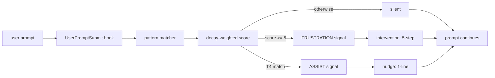

# ccToolBox Docs Restructure Implementation Plan

> **For agentic workers:** REQUIRED SUB-SKILL: Use superpowers:subagent-driven-development (recommended) or superpowers:executing-plans to implement this plan task-by-task. Steps use checkbox (`- [ ]`) syntax for tracking.

**Goal:** Restructure ccToolBox's docs so the top README + per-plugin docs read clearly for quick-skim / deep / installer readers from one set of documents, surfacing crown-jewel design rationale into per-plugin `docs/` writeups and standardizing CHANGELOGs.

**Architecture:** Lean top README (~210 lines) drives readers into per-plugin `docs/<topic>.md` deep-dives. Skill-level `SKILL.md` files gain a one-line "Design rationale" back-link. Existing `docs/superpowers/{plans,specs}/` planning trail stays untouched as the visible record of how each plugin was built. CHANGELOGs across 4 plugins gain a uniform Keep-a-Changelog header while preserving the existing narrative voice.

**Tech Stack:** Markdown only. Mermaid diagrams in fenced code blocks. No code changes to plugins or skills.

**Source spec:** `docs/superpowers/specs/2026-05-19-cctoolbox-docs-restructure-design.md`

---

## Phase 1 — Crown-jewel writeups

Five new writeups land first because everything downstream links into them. Each follows the same four-section shape per spec §7: T2 opener → How it works (with `file:line` refs) → Tradeoffs and hard parts → What's next. Mermaid diagrams preferred over images.

### Task 1.1: `frustration-check.md`

**Files:**
- Create: `plugins/devTools/docs/frustration-check.md`
- Read for material: `plugins/devTools/skills/frustration-check/SKILL.md`, `plugins/devTools/skills/frustration-check/scripts/*.py`, `plugins/devTools/CHANGELOG.md` (entries that mention frustration-check), `docs/superpowers/specs/2026-04-22-frustration-check-skill-design.md`, `docs/superpowers/plans/2026-04-22-frustration-check-skill.md`

- [ ] **Step 1: Gather material**

Read the source files listed above. For each script, note relevant `file:line` ranges that map to: tier pattern matcher, decay-weighted scoring function, corruption-safe state load/save, defensive imports, SessionStart first-run migration.

- [ ] **Step 2: Draft the writeup (~250–350 lines)**

Four sections:

1. **T2 opener (one paragraph, first-person).** "I built `frustration-check` because Claude Code treats every prompt the same — even when I've already said the same thing three times. The drift signal is in the conversation; nothing listens for it." End with the rough product shape (UserPromptSubmit hook → tier match + decay score → consent-gated intervention).

2. **How it works.** Four sub-sections with file:line refs:
   - Tier patterns (T1 constraint repetition / T2 rage-profanity / T3 contradiction-halt / T4 self-realization). Show the regex tier table.
   - Decay-weighted scoring (`score = decayed_prior × 0.5 + (T1×4 + T2×3 + T3×2)`, ≥5 triggers FRUSTRATION, T4 triggers ASSIST). Show calibration numbers from the design doc.
   - Corruption-safe session state (per-session JSON, parse failure → defaults, OSError on write → stderr only, hook never breaks the prompt). Show the "never break the prompt" contract verbatim.
   - Defensive imports + SessionStart first-run migration. Show the `try / except: _IMPORT_ERROR = exc` pattern.

3. **Tradeoffs and hard parts.** Four named decisions with the rejected alternative for each:
   - Why a hook, not a skill (no command discoverability needed; lives on every prompt).
   - Why regex, not embeddings (latency budget — runs on every prompt submit).
   - Why consent-gated, not auto-injected (user agency; intervention without permission is itself drift).
   - Why per-session state, not cross-session (drift is a within-conversation pattern; cross-session would bias the calibration).

4. **What's next.** One paragraph. Open questions: cross-session correlation as opt-in feature; whether the decay constant should adapt to session length; whether T4 phrases should auto-trigger recall-test-knowledge.

- [ ] **Step 3: Add a Mermaid diagram of the hook lifecycle**



- [ ] **Step 4: Cross-link**

Add at top of file (after the H1 title):
```
> Originally documented in [CHANGELOG.md](../CHANGELOG.md) under v1.4.0 (skill introduction) and subsequent v1.4.x / v1.5.x / v1.6.x / v1.7.x refinements.
```

- [ ] **Step 5: Verify file:line refs resolve**

For every `file:line` reference, open the file at that line and confirm the referenced content is present and accurate.

- [ ] **Step 6: Commit**

```bash
git add plugins/devTools/docs/frustration-check.md
git commit -m "docs(devTools): add frustration-check design rationale"
```

### Task 1.2: `skill-distill.md`

**Files:**
- Create: `plugins/devTools/docs/skill-distill.md`
- Read for material: `plugins/devTools/skills/skill-distill/SKILL.md`, `plugins/devTools/CHANGELOG.md` (1.7.0 + 1.7.1 entries), `docs/superpowers/specs/` (any skill-distill-related), `docs/superpowers/plans/` (any skill-distill-related)

- [ ] **Step 1: Gather material**

Read the source files. Note the 5-phase flow (Source → Research → Design → Plan → Ship), the three-lens distillation method (user-prompt patterns / agent decisions / course-corrections), the v1.7.1 subagent dispatch (1.2 magic extraction = 1 subagent; 2.1 prior-art + 2.3 destination = parallel subagents), and the destination-aware bookkeeping (marketplace.json / plugin.json / CHANGELOG / README in lockstep).

- [ ] **Step 2: Draft the writeup (~150–200 lines)**

Four sections:

1. **T2 opener.** "I built `skill-distill` because every successful Claude Code session was a one-shot — patterns that worked got reinvented next time. I wanted the model to teach itself, by promoting working sessions into reusable Skills."

2. **How it works.** The 5-phase flow with file:line refs into `SKILL.md`. The three-lens distillation method (with example for each lens). The v1.7.1 subagent dispatch (1 subagent for magic extraction so the transcript doesn't pollute main context; 2 parallel subagents for prior-art search + destination probe since they're independent). Destination-aware bookkeeping (marketplace / single-plugin / plain repo all handled).

3. **Tradeoffs and hard parts.** Three named decisions with rejected alternatives:
   - Why three lenses, not one (user-prompt patterns alone miss the corrections that paid off; corrections alone miss the framings that worked).
   - Why a subagent for magic extraction, not main context (large transcripts pollute the planning context; isolated extraction preserves the budget).
   - Why destination-aware bookkeeping, not a fixed marketplace target (the same skill might land in a marketplace, a single-plugin repo, or a plain repo with `.claude/skills/`; one-size-fits-one path breaks the others).

4. **What's next.** One paragraph. Open questions: whether the three-lens extraction can run incrementally during a session (not just post-hoc); whether successful distillations should auto-PR into the original session's plugin.

- [ ] **Step 3: Cross-link**

Add at top:
```
> Originally documented in [CHANGELOG.md](../CHANGELOG.md) under v1.7.0 / v1.7.1.
> Architectural decisions shared with [`ui-refinement.md`](ui-refinement.md) — see [`2026-05-06-v1.7.1-refactor.md`](2026-05-06-v1.7.1-refactor.md) for the v1.7.1 postmortem.
```

- [ ] **Step 4: Verify file:line refs resolve**

- [ ] **Step 5: Commit**

```bash
git add plugins/devTools/docs/skill-distill.md
git commit -m "docs(devTools): add skill-distill design rationale"
```

### Task 1.3: `ui-refinement.md`

**Files:**
- Create: `plugins/devTools/docs/ui-refinement.md`
- Read for material: `plugins/devTools/skills/ui-refinement/SKILL.md`, `plugins/devTools/skills/ui-refinement/personas/*.md`, `plugins/devTools/CHANGELOG.md` (1.6.0 + 1.7.0 + 1.7.1 entries)

- [ ] **Step 1: Gather material**

Read the source files. Note the 5-phase loop (Define → Setup → Plan → Execute → Done), the live-browser MCP integration (Playwright preferred, Chrome DevTools fallback, simulator/emulator fallback), the dual-persona instruction-driven critique (`personas/senior-designer.md`, `personas/ruthless-tester.md`), and the design-system guardrail with escalation. Capture the "would a top-tier team ship this?" standard.

- [ ] **Step 2: Draft the writeup (~150–200 lines)**

Four sections:

1. **T2 opener.** "I built `ui-refinement` because UI iteration with Claude Code kept stopping at 'works for the happy path.' I wanted a loop that holds the bar without me sitting in front of it — captures the screen, critiques it as if a senior designer and a ruthless tester were both reviewing, then fixes and re-captures until the standard is met."

2. **How it works.** The 5-phase loop with file:line refs. The MCP integration layer and platform fallback ladder. Instruction-driven personas (the v1.7.1 shift from role-play to rules — short callout, full story lives in `2026-05-06-v1.7.1-refactor.md`). Phase 4.2 parallel subagent dispatch (one runs visual-quality + visual-critique, one runs edge-state). Phase 4.1 aggressive exploration mandate (click every interactive element, walk every flow end-to-end). Design-system guardrail with three options: fix in-line / escalate / document exception.

3. **Tradeoffs and hard parts.** Three named decisions:
   - Why two personas, not one (senior-designer catches polish; ruthless-tester catches edge states; bundled into one persona, the model drops one).
   - Why parallel subagent dispatch, not sequential (keeps main context lean over long iteration loops; same persona context isn't reloaded).
   - Why "top-tier team" as the standard, not "good enough" (the loop converges only on a high bar; "good enough" lets the model exit early on mediocre UI).

4. **What's next.** One paragraph. Open questions: whether the loop should self-tune the bar over multiple sessions; whether mobile vs desktop should split into separate personas; iOS Safari handling.

- [ ] **Step 3: Cross-link**

```
> Originally documented in [CHANGELOG.md](../CHANGELOG.md) under v1.6.0 / v1.7.0 / v1.7.1.
> Architectural decisions shared with [`skill-distill.md`](skill-distill.md) — see [`2026-05-06-v1.7.1-refactor.md`](2026-05-06-v1.7.1-refactor.md) for the v1.7.1 postmortem.
```

- [ ] **Step 4: Verify file:line refs resolve**

- [ ] **Step 5: Commit**

```bash
git add plugins/devTools/docs/ui-refinement.md
git commit -m "docs(devTools): add ui-refinement design rationale"
```

### Task 1.4: `2026-05-06-v1.7.1-refactor.md` (cross-skill postmortem)

**Files:**
- Create: `plugins/devTools/docs/2026-05-06-v1.7.1-refactor.md`
- Read for material: `plugins/devTools/CHANGELOG.md` (v1.7.1 entry verbatim), `plugins/devTools/skills/ui-refinement/personas/*.md`, `plugins/devTools/skills/skill-distill/SKILL.md`, git log for commit `15c4841` (`git show 15c4841`)

- [ ] **Step 1: Gather material**

Read the v1.7.1 CHANGELOG entry. Read `git show 15c4841` for the full diff (the commit that landed v1.7.1). Identify the three concrete changes: persona files reframed (role-play → instruction-driven), subagent dispatch parallelized (sequential → 2-parallel for ui-refinement Phase 4.2 and skill-distill Phase 2.1 + 2.3), aggressive exploration mandated (Phase 4.1 — click every element, walk every flow).

- [ ] **Step 2: Draft the postmortem (~200–300 lines)**

Four sections:

1. **T2 opener (one paragraph).** "v1.7.1 was the refactor I should have done at v1.6 but didn't. Both `ui-refinement` and `skill-distill` had grown role-play persona files ('you are a senior designer', 'you are a ruthless tester') that didn't outperform the simpler instruction-driven versions. Subagent dispatch was sequential where it should have been parallel. Phase 4.1 of `ui-refinement` was running a static screenshot scan when it should have been exploring the app like a real user. This is the postmortem of all three at once."

2. **What changed.** Three sub-sections, one per change:
   - **Persona files: role-play → instruction-driven.** Show before/after snippets of the persona file structure. Explain why role-play underperformed — the model treats persona descriptions as flavor, not rules; explicit imperatives (scan order, finding format, mantras) get applied; role-play framing got ignored. Cite the symptom (drift back to generic UI criticism within 2-3 critiques in role-play mode; consistent finding format in rules mode).
   - **Subagent dispatch: sequential → parallel.** Show the v1.6 single-subagent shape for `ui-refinement` Phase 4.2 and the v1.7.1 two-parallel shape. Same for `skill-distill` Phase 2.1 + 2.3. Explain why: when subagents are independent (visual-quality + edge-state don't share state; prior-art + destination probe don't share state), serialization burns wall-clock and main context.
   - **Phase 4.1: static screenshot → aggressive exploration.** Show the v1.6 instruction and the v1.7.1 mandate ("click every interactive element, open every entrance, exit every exit, try every input, walk every flow end-to-end"). Explain why: static screenshot caught visual polish but missed broken click handlers, modal trap states, error UIs, and form submission paths.

3. **Tradeoffs and hard parts.** Three named decisions with rejected alternatives:
   - Why a single combined refactor, not three separate ones (the three changes are coupled — instruction-driven personas need parallel dispatch to keep the main context lean; aggressive exploration generates more findings which the parallel subagents handle better than one).
   - Why keep the persona file naming, not flatten to `<role>.md` (the persona file is still the "lens" abstraction — the change is in *content*, not in the *role* of the file in the skill).
   - Why apply to two skills at once, not iterate on one first (the second skill would have copied the wrong pattern if I'd waited; the refactor's core lesson is general).

4. **What's next.** One paragraph. Open questions: whether the same pattern applies to `retro` (currently single-subagent); whether persona files should be promoted to a shared library across skills; whether the design-system guardrail in `ui-refinement` should adopt the same instruction-driven shape.

- [ ] **Step 3: Cross-link**

Add at top:
```
> Originally documented in [CHANGELOG.md](../CHANGELOG.md) under v1.7.1.
> Sister writeups: [`skill-distill.md`](skill-distill.md), [`ui-refinement.md`](ui-refinement.md).
```

- [ ] **Step 4: Verify referenced commit and file content match**

`git show 15c4841` — confirm every claimed change in the writeup is in the diff. Resolve any mismatches.

- [ ] **Step 5: Commit**

```bash
git add plugins/devTools/docs/2026-05-06-v1.7.1-refactor.md
git commit -m "docs(devTools): add v1.7.1 refactor postmortem"
```

### Task 1.5: `offline-research/docs/architecture.md`

**Files:**
- Create: `plugins/offline-research/docs/architecture.md`
- Read for material: `plugins/offline-research/skills/{arch-forge,refactor-probe,research-probe}/SKILL.md`, `plugins/offline-research/skills/*/templates/*.md`, `containers/workshop/launch.sh`, `containers/workshop/entrypoint.sh`, `plugins/offline-research/CHANGELOG.md`, `docs/superpowers/specs/2026-04-03-arch-forge-design.md`, `docs/superpowers/specs/2026-04-06-refactor-probe-workshop-design.md`, `docs/superpowers/plans/2026-04-03-arch-forge.md`

- [ ] **Step 1: Gather material**

Read the source files. Note: container lifecycle (`launch.sh` argument parsing, `entrypoint.sh` startup), structured I/O contract (prompt.md / progress.md / critique-loop.md / scoring-rubric.md as the four shared templates), plateau math (Δ ≤ 3 for 2 scores → CONCLUDED), dimension-aware expansion (arch-forge's BUILD / INVESTIGATE / RETHINK / REFOCUS hint tags), rubric co-design flow (refactor-probe), max-iter formulas (research: `topics × 8 + 10`; arch: `decisions × 10 + 15`; refactor: `topics × 10 + 15`), schedule-aware resume (`RESEARCH_HOURS=23:00-07:00`).

- [ ] **Step 2: Draft the architecture writeup (~250–350 lines)**

Four sections:

1. **T2 opener.** "I built `offline-research` because long-running exploration with Claude inside a chat is broken — token budget, attention drift, no persistence across restarts. The container is the UX boundary. A specialized skill writes a structured prompt + progress + rubric; the container reads them, runs hours of work in isolation, and produces scored alternatives plus PoC code as artifacts."

2. **How it works.** Five sub-sections:
   - Container lifecycle. `launch.sh` argument parsing (research / arch / refactor variant), Dockerfile choice (lightweight vs heavy), volume mounts (`/workspace` + auth dir), user dropping (root → node; arch/refactor adds a `poc` user for sandboxed PoC code execution).
   - Structured I/O contract. The four templates (prompt.md = mission + workspace + workflow; progress.md = scoreboard table + linear task queue; critique-loop.md = Sonnet subagent isolation rule + plateau math; scoring-rubric.md = 5 dimensions × {0, 5, 10} anchors). Why the contract: container reads files, not flags. Resumable.
   - Critique loop with plateau math. Spawn Sonnet with ONLY rubric + one topic's output. Δ > 3 = gaining → append improve task. Δ ≤ 3, streak 0 = first plateau → one more attempt. Δ ≤ 3, streak ≥ 1 = CONCLUDED.
   - Dimension-aware expansion (arch-forge specific). Feasibility < 6 → BUILD a PoC. Maintainability < 6 → decompose. Risk < 6 → INVESTIGATE failure modes. Effort < 6 → find simpler alternative. Alignment < 6 → REFOCUS (overrides others). Minimum 2 approaches before CONCLUDED.
   - Rubric co-design (refactor-probe specific). User and skill co-design scoring dimensions during intake; each dimension carries a BUILD / INVESTIGATE / RETHINK / REFOCUS hint tag that drives loop expansion behavior.

3. **Tradeoffs and hard parts.** Four named decisions:
   - Why a container, not a long-running Claude session (token budget, attention drift, no restart resumability).
   - Why Sonnet for critique, not Opus (cost; the rubric work doesn't need Opus capability).
   - Why subagent isolation (no exploration history), not full context (self-justification drift — a model that sees its own prior work argues for it).
   - Why plateau math, not a fixed iteration cap (different topics converge at different rates; a fixed cap wastes budget on easy topics and cuts off hard ones).

4. **What's next.** One paragraph. Open questions: cross-topic transfer (insights from one topic informing another); rubric versioning (when the scoring rubric itself needs updating mid-loop); host-side scheduling (currently `RESEARCH_HOURS` env var; could be a calendar integration).

- [ ] **Step 3: Add a Mermaid diagram of the container lifecycle**

```mermaid
flowchart TB
  H[host: launch.sh] -->|--container=research/arch/refactor| D[Docker image build]
  D --> C[container start: entrypoint.sh]
  C -->|drop to node user| W[/workspace volume]
  W --> R[Claude reads prompt.md + progress.md]
  R --> T[execute ONE task]
  T --> X[update progress.md scoreboard]
  X --> P{plateau check}
  P -->|Δ > 3| R
  P -->|Δ ≤ 3, streak ≥ 1| F[CONCLUDED]
  P -->|429 rate limit| S[pause + wait]
  S --> R
```

- [ ] **Step 4: Cross-link**

```
> Originally documented in [CHANGELOG.md](../CHANGELOG.md).
> Related design specs: [`2026-04-03-arch-forge-design.md`](../../../docs/superpowers/specs/2026-04-03-arch-forge-design.md), [`2026-04-06-refactor-probe-workshop-design.md`](../../../docs/superpowers/specs/2026-04-06-refactor-probe-workshop-design.md).
```

- [ ] **Step 5: Verify file:line refs resolve**

- [ ] **Step 6: Commit**

```bash
git add plugins/offline-research/docs/architecture.md
git commit -m "docs(offline-research): add container architecture writeup"
```

---

## Phase 2 — CHANGELOG standardization + bidirectional links

### Task 2.1: Standardize all four plugin CHANGELOG headers + entry subsection format

**Files:**
- Modify: `plugins/devTools/CHANGELOG.md`
- Modify: `plugins/offline-research/CHANGELOG.md`
- Modify: `plugins/daily-briefing/CHANGELOG.md`
- Modify: `plugins/daily-briefing-opencode/CHANGELOG.md`

- [ ] **Step 1: Read all four CHANGELOG files**

Note the current shape of each. devTools is narrative-rich without `### Added/Changed/Fixed/Removed` subsections; offline-research and daily-briefing-opencode TBD; daily-briefing already uses subsections.

- [ ] **Step 2: Apply uniform header to all four**

Replace the top of each file with this header (substituting `<plugin-name>` per file):

```markdown
# Changelog

All notable changes to the <plugin-name> plugin are documented here.
Format based on [Keep a Changelog](https://keepachangelog.com/en/1.1.0/).
This project follows [Semantic Versioning](https://semver.org/).

## [Unreleased]
```

- [ ] **Step 3: Slot existing narrative entries under `### Added / Changed / Fixed / Removed`**

For each version entry across all four CHANGELOGs, group bullets under the matching subsection. **Preserve voice verbatim.** Do not rewrite a "model treats role-play as noise and rules as signal" sentence — slot it under `### Changed` as written. Keep dates as written.

For devTools v1.7.1 specifically, the existing narrative needs to be split into the three `### Changed` items already documented (persona reframe, parallel subagent dispatch, aggressive exploration). Group them all under one `### Changed` block under the v1.7.1 header.

- [ ] **Step 4: Render-check all four files**

Open each in a Markdown preview locally. Confirm the header renders, the subsection structure is consistent, and no original content is dropped.

- [ ] **Step 5: Commit**

```bash
git add plugins/devTools/CHANGELOG.md plugins/offline-research/CHANGELOG.md \
        plugins/daily-briefing/CHANGELOG.md plugins/daily-briefing-opencode/CHANGELOG.md
git commit -m "chore: standardize plugin CHANGELOGs to Keep-a-Changelog format

Voice preserved verbatim; format-only pass. Adds [Unreleased]
section + ### Added / Changed / Fixed / Removed subsections per
version."
```

### Task 2.2: Bidirectional CHANGELOG ↔ docs/<topic>.md links

**Files:**
- Modify: `plugins/devTools/CHANGELOG.md`
- Modify: `plugins/offline-research/CHANGELOG.md`
- Modify: `plugins/devTools/docs/frustration-check.md` (already has the reverse link from Task 1.1)
- Modify: `plugins/devTools/docs/skill-distill.md`
- Modify: `plugins/devTools/docs/ui-refinement.md`
- Modify: `plugins/devTools/docs/2026-05-06-v1.7.1-refactor.md`
- Modify: `plugins/offline-research/docs/architecture.md`

- [ ] **Step 1: Add forward links from CHANGELOG entries to docs/<topic>.md**

For each version-entry that has a matching writeup, append at the end of the entry (one blank line above):

```markdown
> Deep dive: [docs/<topic>.md](docs/<topic>.md)
```

Mapping:
- devTools v1.7.1 (2026-05-06) → `> Deep dive: [docs/2026-05-06-v1.7.1-refactor.md](docs/2026-05-06-v1.7.1-refactor.md)`
- devTools v1.7.0 (2026-05-04, skill-distill addition) → `> Deep dive: [docs/skill-distill.md](docs/skill-distill.md)`
- devTools v1.6.0 (2026-05-04, ui-refinement addition) → `> Deep dive: [docs/ui-refinement.md](docs/ui-refinement.md)`
- devTools v1.4.0 (2026-04-23, frustration-check addition) → `> Deep dive: [docs/frustration-check.md](docs/frustration-check.md)`
- offline-research: pick the earliest version where the container workshop is stable (likely v2.0.0). Verify by reading `plugins/offline-research/CHANGELOG.md` and identifying the version that ships the shared `containers/workshop/` + the four shared templates. Add: `> Deep dive: [docs/architecture.md](docs/architecture.md)` to that entry.

- [ ] **Step 2: Verify reverse links exist in each writeup**

Each writeup created in Phase 1 already includes a reverse-link block at the top of the file (per Task 1.1–1.5 step "Cross-link"). Open each writeup and confirm the `> Originally documented in [CHANGELOG.md](...)` line is present. Add if missing.

- [ ] **Step 3: Cross-link verification — every link resolves**

Run:
```bash
cd ~/Development/ccToolBox
grep -rEoh '\[.*?\]\([^)]+\)' plugins/devTools/CHANGELOG.md plugins/offline-research/CHANGELOG.md plugins/devTools/docs/*.md plugins/offline-research/docs/*.md \
  | grep -oE '\([^)]+\)' \
  | tr -d '()' \
  | while read p; do
      # Skip http(s) links
      case "$p" in
        http*) continue ;;
      esac
      # Resolve relative to each file's directory — naive but enough for sanity check
      echo "CHECK: $p"
    done
```

For each printed path, manually verify the target exists.

- [ ] **Step 4: Commit**

```bash
git add plugins/devTools/CHANGELOG.md plugins/offline-research/CHANGELOG.md \
        plugins/devTools/docs/*.md plugins/offline-research/docs/*.md
git commit -m "docs: bidirectional CHANGELOG <-> docs/<topic>.md links"
```

---

## Phase 3 — Top README rewrite + docs/README.md

### Task 3.1: Rewrite top-level README.md

**Files:**
- Modify: `README.md` (full rewrite, 73 → ~210 lines target)

- [ ] **Step 1: Read the spec for canonical content**

Read `docs/superpowers/specs/2026-05-19-cctoolbox-docs-restructure-design.md` sections §6 (top README section budgets), §6.1 (Mermaid diagram canonical version), §6.2 (comparison table canonical version), §3 (voice constraints).

- [ ] **Step 2: Write §1 — 30-second hook (~15 lines)**

T2 voice. First-person. Three to five lines naming the four crown jewels by the friction that triggered them. End with a one-line install snippet so the installer reader has an exit.

Reference structure (do not copy verbatim — write in the owner's voice):

```markdown
# ccToolBox

Tools I built when Claude Code didn't quite do what I needed.

- `frustration-check` — Claude treats every prompt the same. I wanted it to notice when I've said the same thing three times.
- `offline-research` — Long-running exploration is broken in a single Claude session. The container is the UX boundary.
- `skill-distill` — Successful sessions kept dying without propagating. I wanted the model to teach itself.
- `ui-refinement` — UI iteration kept stopping at "works for the happy path." I wanted a loop that holds the bar.

Install: `claude plugins marketplace add github:dev32-io/ccToolBox && claude plugins install devTools@ccToolBox`
```

- [ ] **Step 3: Write §2 — Architecture (Mermaid)**

Paste the canonical Mermaid diagram from spec §6.1 verbatim into a fenced ```mermaid block.

- [ ] **Step 4: Write §3 — Crown jewels (~50 lines, ~12 per jewel)**

One paragraph per crown jewel. Shape: pain that started it (1–2 sentences) + key design choice (1–2 sentences) + link out. Order: frustration-check, offline-research, skill-distill, ui-refinement.

Example shape (for frustration-check, in T2 voice):

```markdown
### `frustration-check` — drift detection in real time

Claude Code treats every prompt the same. When I'd said the same thing
three times and Claude was still missing the point, nothing in the
runtime noticed. I wanted a hook that listened for that signal and
offered a step-back without overriding me.

It's a `UserPromptSubmit` hook with tiered regex pattern matching + a
decay-weighted score. Score crosses a threshold, the user gets a
consent-gated intervention (drift scan / knowledge-gap lookup / push
on). The hook is corruption-safe — it never breaks the prompt.

→ [Design rationale: `plugins/devTools/docs/frustration-check.md`](plugins/devTools/docs/frustration-check.md)
```

Repeat the same structure for offline-research, skill-distill, ui-refinement.

- [ ] **Step 5: Write §4 — Everything else table (~20 lines)**

One row per remaining skill/plugin. Columns: name, one-liner, install command.

```markdown
### Everything else

| Plugin/skill | What it does | Install |
|---|---|---|
| `daily-briefing` | Vintage broadsheet personal briefing, 12 sources, TTS | `claude plugins install daily-briefing@ccToolBox` |
| `retro` (in devTools) | Branch retrospective — distill diff + session into rules / learnings / tests | (bundled with devTools) |
| `qa-session` (in devTools) | Session-Based Test Management — Explorer + Reporter subagents | (bundled with devTools) |
| `recall-test-knowledge` (in devTools) | Auto-load testing-knowledge for test-related intent | (bundled with devTools) |
| `research-probe` (in offline-research) | Long-running research loop in container | `claude plugins install offline-research@ccToolBox` |
| `arch-forge` (in offline-research) | Architecture exploration in container | (bundled) |
| `refactor-probe` (in offline-research) | Refactor scoring loop in container | (bundled) |
```

Do **not** include `daily-briefing-opencode` in this table.

- [ ] **Step 6: Write §5 — How it's built (~25 lines)**

Three short paragraphs:

1. T1 architectural callout. "Across plugins, ccToolBox treats Claude as a runtime you program: hooks gate prompts, loops have plateau math, rubrics steer convergence, containers are a UX boundary, subagents see isolated context, settings are versioned with migration."
2. Honest AI-tooling disclosure. "Built with Claude Code. Commit attribution is preserved (look for `Co-authored-by: Claude` trailers). The planning trail is visible under [`docs/superpowers/`](docs/superpowers/) — every plugin started as a spec, became an executable plan, then code."
3. One-line OpenCode mention. "A `daily-briefing-opencode` port exists as a multi-runtime experiment; the same plugin shape runs on both Claude Code and OpenCode."

- [ ] **Step 7: Write §6 — vs alternatives (~15 lines)**

Paste the canonical comparison table from spec §6.2 verbatim.

- [ ] **Step 8: Write §7 — Install + setup (~25 lines)**

Move the current install section content (from the existing 73-line README) under this heading. Preserve all install / update / uninstall commands. Add a sentence at the start: "All plugins are installed via the Claude Code marketplace command."

- [ ] **Step 9: Write §8 — Adding your own plugins (~10 lines)**

One short paragraph pointing to `CLAUDE.md` (the existing plugin-authoring guide). One sentence on the settings convention (versioned settings + migration script per plugin; see `daily-briefing` for the reference shape).

- [ ] **Step 10: Write §9 — License (~3 lines)**

```markdown
## License

MIT.
```

- [ ] **Step 11: Line-count verification**

Run:
```bash
wc -l README.md
```
Expected: 180–220 lines. If significantly outside the range, trim or expand specific sections; do not pad.

- [ ] **Step 12: Render verification**

Open README.md in a Markdown preview locally. Confirm:
- Mermaid diagram renders inline
- Comparison table aligns
- All anchor links work (clicking section heading links navigates correctly)
- Crown-jewel writeup links resolve (no 404s in the relative paths)

- [ ] **Step 13: Drop AI-tell vocabulary scan**

Run:
```bash
grep -iE '\b(leveraged|spearheaded|utilized|pivotal|crucial|delve|underscore|showcasing|vibrant|fostering|paradigm shift)\b' README.md
```
Expected: no matches. If any match, rewrite to use a specific verb.

- [ ] **Step 14: Commit**

```bash
git add README.md
git commit -m "docs: rewrite top-level README

Lean ~210-line README replaces the prior 73-line install guide.
Adds: 30-second hook, Mermaid architecture diagram, 4 crown-jewel
paragraphs with links into per-plugin docs/, comparison table vs
Cursor rules / Copilot instructions / Aider conventions / plain
CLAUDE.md, How-it's-built block with explicit Claude Code
attribution.

Install section moved below the fold; the marketplace add +
plugin install commands remain unchanged."
```

### Task 3.2: New `docs/README.md`

**Files:**
- Create: `docs/README.md`

- [ ] **Step 1: Write the file (~15 lines)**

```markdown
# docs/

Process artifacts for ccToolBox.

Every plugin in this repo started as a design spec under [`superpowers/specs/`](superpowers/specs/), became an executable plan with checkbox-tracked tasks under [`superpowers/plans/`](superpowers/plans/), then shipped as code. The trail stays visible because the process is the work — ccToolBox is built with [Claude Code](https://claude.com/claude-code) via the [superpowers](https://github.com/anthropics/claude-plugins-official) + [agentic-dev-harness](https://github.com/dev32-io/agentic-dev-harness) setup.

For per-plugin design rationale (the *why*, not the *how-to-use*), see each plugin's `docs/` directory:

- [`plugins/devTools/docs/`](../plugins/devTools/docs/) — frustration-check, skill-distill, ui-refinement, 2026-05-06 v1.7.1 refactor postmortem
- [`plugins/offline-research/docs/`](../plugins/offline-research/docs/) — container architecture

Per-skill usage lives in each skill's `SKILL.md`.
```

- [ ] **Step 2: Render-check**

Open in a Markdown preview locally. Confirm all relative links resolve.

- [ ] **Step 3: Commit**

```bash
git add docs/README.md
git commit -m "docs: add docs/ orientation README

Single-paragraph orientation for visitors who navigate down from
the top README to the docs/ tree. Points at per-plugin docs/
directories for design rationale; explains the
specs/ -> plans/ -> code trail."
```

---

## Phase 4 — Plugin README trim + SKILL.md back-links

### Task 4.1: Trim `plugins/devTools/README.md` (217 → ~130)

**Files:**
- Modify: `plugins/devTools/README.md`

- [ ] **Step 1: Read current state**

Read the existing 217-line README. Identify the sections that fully describe `frustration-check`, `skill-distill`, `ui-refinement` (and partially `retro`, `qa-session`, `recall-test-knowledge`).

- [ ] **Step 2: For each crown-jewel skill, replace full description with 2–3 line summary + link**

Template (substituting per skill):

```markdown
### `<skill-name>`

<2-3 line summary of what the skill does and when to invoke it.>

→ [Design rationale: `docs/<skill-name>.md`](docs/<skill-name>.md)
```

Apply to: `frustration-check`, `skill-distill`, `ui-refinement`.

- [ ] **Step 3: Keep `retro`, `qa-session`, `recall-test-knowledge` sections at current depth**

These skills don't have their own `docs/<topic>.md` writeup, so the README is their only depth.

- [ ] **Step 4: Add footer link to CHANGELOG**

At the end of the README, add:

```markdown
---

See [CHANGELOG.md](CHANGELOG.md) for version history.
```

- [ ] **Step 5: Line-count verification**

```bash
wc -l plugins/devTools/README.md
```
Expected: 110–145 lines.

- [ ] **Step 6: Render verification + cross-link check**

Open in preview. Click each `→ Design rationale` link; confirm it resolves to the matching `docs/<topic>.md`.

- [ ] **Step 7: Commit**

```bash
git add plugins/devTools/README.md
git commit -m "docs(devTools): trim README — crown-jewel depth moves to docs/

Crown-jewel skills (frustration-check, skill-distill, ui-refinement)
now have 2-3 line summaries in the README with links out to per-skill
docs/<topic>.md design-rationale writeups. retro / qa-session /
recall-test-knowledge sections unchanged (no separate writeup yet).
CHANGELOG link added at footer."
```

### Task 4.2: Trim `plugins/offline-research/README.md` (155 → ~100)

**Files:**
- Modify: `plugins/offline-research/README.md`

- [ ] **Step 1: Read current state**

Identify the architectural content (container lifecycle, structured I/O contract, plateau math) that duplicates what now lives in `docs/architecture.md`.

- [ ] **Step 2: Remove architectural deep-dive content; keep user-facing content**

Keep: skill triggers, workshop usage (how to launch a research / arch / refactor container, where artifacts land, how to resume), environment variables (`RESEARCH_HOURS`).

Remove: container internals, plateau math details, subagent isolation rationale, dimension-aware expansion details. Replace removed sections with:

```markdown
For container architecture, structured I/O contract, plateau math, and dimension-aware expansion, see [`docs/architecture.md`](docs/architecture.md).
```

- [ ] **Step 3: Add footer link to CHANGELOG**

```markdown
---

See [CHANGELOG.md](CHANGELOG.md) for version history.
```

- [ ] **Step 4: Line-count verification**

```bash
wc -l plugins/offline-research/README.md
```
Expected: 85–110 lines.

- [ ] **Step 5: Render verification + cross-link check**

- [ ] **Step 6: Commit**

```bash
git add plugins/offline-research/README.md
git commit -m "docs(offline-research): trim README — architecture moves to docs/

Container architecture deep dive moves to docs/architecture.md.
README keeps user-facing skill triggers and workshop usage. CHANGELOG
link added at footer."
```

### Task 4.3: SKILL.md back-links (6 skills) + daily-briefing README CHANGELOG footer

**Files:**
- Modify: `plugins/devTools/skills/frustration-check/SKILL.md`
- Modify: `plugins/devTools/skills/skill-distill/SKILL.md`
- Modify: `plugins/devTools/skills/ui-refinement/SKILL.md`
- Modify: `plugins/offline-research/skills/arch-forge/SKILL.md`
- Modify: `plugins/offline-research/skills/refactor-probe/SKILL.md`
- Modify: `plugins/offline-research/skills/research-probe/SKILL.md`
- Modify: `plugins/daily-briefing/README.md`

- [ ] **Step 1: Append back-link to each crown-jewel SKILL.md**

Add one line at the end of each SKILL.md (after the last existing content, separated by a blank line):

For `plugins/devTools/skills/frustration-check/SKILL.md`:
```markdown

Design rationale: [`../../docs/frustration-check.md`](../../docs/frustration-check.md)
```

For `plugins/devTools/skills/skill-distill/SKILL.md`:
```markdown

Design rationale: [`../../docs/skill-distill.md`](../../docs/skill-distill.md)
```

For `plugins/devTools/skills/ui-refinement/SKILL.md`:
```markdown

Design rationale: [`../../docs/ui-refinement.md`](../../docs/ui-refinement.md)
```

For each of the three offline-research skill SKILL.md files (`arch-forge`, `refactor-probe`, `research-probe`):
```markdown

Design rationale: [`../../docs/architecture.md`](../../docs/architecture.md)
```

- [ ] **Step 2: Verify the back-links don't break skill discovery**

Run:
```bash
ls plugins/devTools/skills/frustration-check/SKILL.md plugins/devTools/skills/skill-distill/SKILL.md plugins/devTools/skills/ui-refinement/SKILL.md \
   plugins/offline-research/skills/arch-forge/SKILL.md plugins/offline-research/skills/refactor-probe/SKILL.md plugins/offline-research/skills/research-probe/SKILL.md
```
Expected: all six files exist and contain the back-link at the end.

Open one of them and confirm the YAML frontmatter at the top is intact (skill loader reads frontmatter; if frontmatter is broken, skill won't load).

- [ ] **Step 3: Add CHANGELOG footer to daily-briefing README**

Append to `plugins/daily-briefing/README.md`:
```markdown

---

See [CHANGELOG.md](CHANGELOG.md) for version history.
```

- [ ] **Step 4: Commit**

```bash
git add plugins/devTools/skills/frustration-check/SKILL.md \
        plugins/devTools/skills/skill-distill/SKILL.md \
        plugins/devTools/skills/ui-refinement/SKILL.md \
        plugins/offline-research/skills/arch-forge/SKILL.md \
        plugins/offline-research/skills/refactor-probe/SKILL.md \
        plugins/offline-research/skills/research-probe/SKILL.md \
        plugins/daily-briefing/README.md
git commit -m "docs: SKILL.md design-rationale back-links + daily-briefing CHANGELOG link

Six crown-jewel SKILL.md files append a single-line back-link to
their plugin-level docs/<topic>.md design rationale. Loader only
reads frontmatter + body; siblings load on demand. daily-briefing
README adds CHANGELOG footer link."
```

---

## Phase 5 — Verification

### Task 5.1: Cross-link sweep + render check + cold-read smoke

**Files:** none modified (verification only)

- [ ] **Step 1: Enumerate every internal markdown link added or modified across the restructure**

Run:
```bash
cd ~/Development/ccToolBox
grep -rEoh '\[[^]]+\]\([^)]+\)' README.md docs/README.md \
  plugins/devTools/README.md plugins/devTools/CHANGELOG.md plugins/devTools/docs/*.md \
  plugins/devTools/skills/*/SKILL.md \
  plugins/offline-research/README.md plugins/offline-research/CHANGELOG.md \
  plugins/offline-research/docs/*.md \
  plugins/offline-research/skills/*/SKILL.md \
  plugins/daily-briefing/README.md plugins/daily-briefing/CHANGELOG.md \
  | grep -oE '\([^)]+\)' \
  | tr -d '()' \
  | sort -u
```

- [ ] **Step 2: For every relative-path link printed in step 1, verify the target exists**

For each path (not starting with `http`), open it relative to its source file and confirm the file exists. Any broken link → identify which source file, fix the link, re-stage, amend the commit that introduced it.

- [ ] **Step 3: Render all rewritten/new Markdown files**

Open each of the following in a Markdown preview locally (or push to a temporary branch and view on GitHub):
- `README.md`
- `docs/README.md`
- `plugins/devTools/README.md`
- `plugins/devTools/CHANGELOG.md`
- `plugins/devTools/docs/*.md` (all 4)
- `plugins/offline-research/README.md`
- `plugins/offline-research/CHANGELOG.md`
- `plugins/offline-research/docs/architecture.md`
- `plugins/daily-briefing/CHANGELOG.md`
- `plugins/daily-briefing-opencode/CHANGELOG.md`

Confirm: Mermaid diagrams render inline, tables align, fenced code blocks have language tags, no broken `[link]` syntax.

- [ ] **Step 4: Cold-read smoke test**

Open the top README (`README.md`) in a fresh tab without any other context. Read for 60 seconds. Can you describe in one paragraph: what ccToolBox is, what's most distinctive about it, and how to install one plugin? If any answer is unclear, identify which section failed and revise.

- [ ] **Step 5: AI-tell vocabulary final scan**

Run across all rewritten/new files:
```bash
grep -iE '\b(leveraged|spearheaded|utilized|pivotal|crucial|delve|underscore|showcasing|vibrant|fostering|paradigm shift|results-driven|seamless|robust|cutting-edge)\b' \
  README.md docs/README.md \
  plugins/devTools/README.md plugins/devTools/docs/*.md \
  plugins/offline-research/README.md plugins/offline-research/docs/*.md
```
Expected: no matches. If any match, rewrite to use a specific verb or particular noun.

- [ ] **Step 6: No commit — verification only**

This task produces no commit. Any fixes made during verification get amended into the commit that introduced the issue (`git rebase -i --autosquash` or amend the matching commit).

---

## Self-review checklist (for the engineer who runs this plan)

After all phases complete, verify against the spec:

- [ ] Every "in scope" item in spec §4 has a matching task in this plan. (Verify: top README rewrite = Task 3.1; 5 new writeups = Tasks 1.1–1.5; CHANGELOG standardization = Task 2.1; bidirectional links = Task 2.2; plugin README trim = Tasks 4.1, 4.2; docs/README.md = Task 3.2; SKILL.md back-links = Task 4.3; daily-briefing README CHANGELOG link = Task 4.3.)
- [ ] Every "out of scope" item in spec §4 has been left alone. (Verify: no ccToolBox rename; `docs/superpowers/{plans,specs}/` untouched; no top-level CHANGELOG; no screencast; no CI badge work; no MkDocs; no per-skill READMEs created; no `daily-briefing-opencode` polish; no plugin code changes.)
- [ ] All four CHANGELOGs share the same Keep-a-Changelog header text.
- [ ] All 5 writeups follow the same 4-section shape (T2 opener / How it works / Tradeoffs / What's next).
- [ ] All AI-tell vocabulary stripped (verified in Phase 5 Step 5).
- [ ] All internal links resolve (verified in Phase 5 Steps 1–2).
- [ ] Top README is 180–220 lines (verified in Task 3.1 Step 11).
- [ ] devTools README is 110–145 lines (verified in Task 4.1 Step 5).
- [ ] offline-research README is 85–110 lines (verified in Task 4.2 Step 4).

If any check fails, fix inline and amend the matching commit.

---

End of plan.
