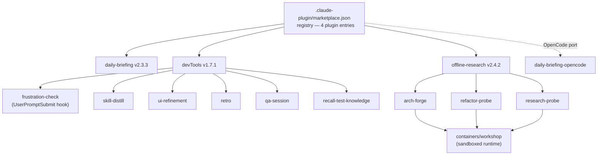

# ccToolBox Docs Restructure — Design

**Date:** 2026-05-19
**Status:** Draft → pending user review before plan
**Author:** Kevin Ye (brainstorm with Claude)

---

## 1. Problem

`ccToolBox` is a personal Claude Code plugin marketplace
(`github.com/dev32-io/ccToolBox`). The top-level README is currently 73 lines
and reads as a thin install guide. The repo actually holds 4 plugins, ~10
skills, marketplace mechanics, a container workshop, an OpenCode runtime
bridge, ~40 plan files, and ~14 design specs — and none of that depth shows up
to a visitor in the first 30 seconds.

Plugin-level READMEs carry uneven detail (devTools 217 lines, offline-research
155, daily-briefing 91) and don't link to each other coherently. CHANGELOGs
use mixed formats across plugins (devTools narrative-rich, daily-briefing
Keep-a-Changelog strict). The "crown jewel" skills — `frustration-check`,
`offline-research`, `skill-distill`, `ui-refinement` — lack dedicated
design-rationale writeups that explain *why* they exist and *what was hard* —
only the functional `SKILL.md` files do.

The repo functions both as an installable collection of tools and as a
readable record of how those tools were built. The docs need to serve both
without privileging one.

## 2. Goal

Restructure ccToolBox's documentation so the top README plus per-plugin docs
read clearly and authentically for three kinds of reader:

1. **Quick-skim reader (P0).** Has ~60 seconds, reads top README only. Wants
   to know what this repo is and whether anything stands out.
2. **Deep reader (P0).** Has 3–5 minutes, follows links to one or two
   crown-jewel writeups. Wants the *why* and *how* of the rare pieces.
3. **Plugin installer (P1).** Has the install command in mind already, just
   needs to find and run it.

The same top README has to serve all three from one document. That is the
hardest constraint of this design.

## 3. Voice and framing

Three threads run through the work; the docs need to communicate them
together:

- **T2 — origin (lead voice).** "I built these things because Claude Code
  didn't quite do what I needed." Pain → fix → share. Each crown jewel has a
  concrete friction story that started it.
- **T1 — architectural through-line.** Across plugins, the work treats Claude
  as a runtime you program: hooks gate prompts, loops have plateau math,
  rubrics steer convergence, containers are a UX boundary, subagents see
  isolated context, settings are versioned. That's the architectural thread
  that makes 4 plugins feel like one ccToolBox.
- **T3 — outcome.** Production-grade discipline (versioned settings,
  migration, tests, multi-runtime parity) is the result of T2 + T1 plus time.
  Mentioned factually; not used as the lead.

Writing constraints applied throughout:

- AI tooling stays surfaced. `Co-authored-by: Claude` trailers, the
  `docs/superpowers/` planning trail, and an explicit "built with Claude Code"
  disclosure are part of the work, not artifacts to hide.
- Lead with the genuine "why" of each piece. Where a side effect happens to
  benefit some other goal, it stays a side effect, not the reason.
- Generic LLM vocabulary (leveraged / spearheaded / utilized / pivotal /
  crucial / delve / underscore / showcasing) is replaced with specific verbs.
  Em-dashes for parenthetical emphasis become periods. Sentence rhythm varies.
  Specific particulars favored over generic claims.

## 4. Scope

**In scope:**

- Rewrite top-level `README.md` (73 → ~210 lines target).
- Five new design-rationale writeups under `plugins/<plugin>/docs/`:
  - `plugins/devTools/docs/frustration-check.md`
  - `plugins/devTools/docs/skill-distill.md`
  - `plugins/devTools/docs/ui-refinement.md`
  - `plugins/devTools/docs/2026-05-06-v1.7.1-refactor.md` (cross-skill postmortem)
  - `plugins/offline-research/docs/architecture.md` (cross-skill: arch-forge / refactor-probe / research-probe share a workshop)
- Standardize all four plugin CHANGELOGs to a Keep-a-Changelog format while
  preserving the existing narrative voice.
- Add bidirectional links: CHANGELOG version-entries ↔ matching `docs/<topic>.md` writeups.
- Trim plugin READMEs (devTools 217 → ~130, offline-research 155 → ~100) so depth lives in `docs/`; READMEs become navigators + install instructions.
- Add a short `docs/README.md` orienting visitors to the `docs/superpowers/` planning trail.
- Append a single-line "Design rationale" link to each affected `SKILL.md` pointing at the matching `plugins/<plugin>/docs/<topic>.md`.

**Out of scope (deferred to separate work):**

- Rename `ccToolBox` (declined — preserve existing URL momentum).
- Restructure `docs/superpowers/{plans,specs}/` (kept as-is; the planning trail is the evidence).
- Top-level repo `CHANGELOG.md` (declined — natural navigation chain runs top README → plugin README → plugin CHANGELOG; plugins version independently).
- Screencast (separate effort).
- CI badge / GitHub Actions setup (separate decision).
- MkDocs / Docusaurus site.
- Per-skill READMEs (Claude Code convention: `SKILL.md` covers user-facing usage; design rationale lives in plugin-level `docs/`).
- `daily-briefing-opencode` polish (kept as the experimental runtime-port footprint it currently is).
- Content changes to `daily-briefing` README (only adds a CHANGELOG footer link).
- Code changes to plugins or skills.
- Adding new plugins or skills.

## 5. Reader model and verdict criteria

| Reader | Time budget | Reads | Key question |
|---|---|---|---|
| Quick-skim | ~60s | top README first ~120 lines | "Can I tell what this is and whether it's worth deeper attention?" |
| Deep | 3–5 min | top README in full + 1–2 crown-jewel writeups | "What are the rare or distinctive parts? How was this built?" |
| Installer | as needed | install section + plugin README | "Can I install this in 30 seconds?" |

## 6. Top README structure

Section budgets sum to ~210 lines. Order matters: the quick-skim reader reads
top-to-bottom and weights the first ~100 lines heavily; the installer scrolls
past the upper half to the install snippet without confusion; the deep reader
reads everything plus follows links.

| # | Section | Lines | Job |
|---|---|---:|---|
| §1 | 30-second hook | ~15 | T2 voice — "I built these because Claude Code didn't quite do what I needed." Names the 4 crown jewels by the friction that triggered them. Ends with a one-line install snippet so the installer has an exit. |
| §2 | Architecture (Mermaid) | ~30 | T1 visual through-line. Renders inline on GitHub. Communicates marketplace → plugins → skills → containers → runtimes in 5 seconds. |
| §3 | Crown jewels (×4) | ~50 | One paragraph (~12 lines) per crown jewel — the friction that started it + key design choice + link to `plugins/<plugin>/docs/<topic>.md`. Order: frustration-check, offline-research, skill-distill, ui-refinement. |
| §4 | Everything else (table) | ~20 | One-line per remaining plugin/skill in a single table: daily-briefing + retro + qa-session + recall-test-knowledge + research-probe + arch-forge + refactor-probe. No deep callouts. |
| §5 | How it's built | ~25 | T1 architectural callout ("treats Claude as a runtime you program: hooks gate prompts, loops have plateau math, rubrics steer convergence, containers are a UX boundary"). Honest AI-tooling disclosure ("built with Claude Code; commit attribution preserved; planning trail visible in `docs/superpowers/`"). One line on the OpenCode multi-runtime port. |
| §6 | vs alternatives | ~15 | Comparison table — ccToolBox vs Cursor rules vs Copilot custom instructions vs Aider conventions vs plain CLAUDE.md. 6 capability rows + 1 honest-cost row. |
| §7 | Install + setup | ~25 | The current install content (marketplace add, plugin install/update/uninstall, list of plugins), moved down. |
| §8 | Adding your own plugins | ~10 | Pointer to existing `CLAUDE.md` plugin-authoring guide. |
| §9 | License | ~3 | MIT. |

### 6.1 §2 Mermaid diagram (canonical version)



Communicates T1 in 5 seconds: hooks at the prompt boundary, containers at the
execution boundary, multi-runtime port via OpenCode.

### 6.2 §6 Comparison table (canonical version)

| Capability | ccToolBox | Cursor rules | Copilot instr | Aider conv | plain CLAUDE.md |
|---|---|---|---|---|---|
| Per-prompt hooks (drift detection, metacognition) | ✓ | ✗ | ✗ | ✗ | ✗ |
| Long-running container loops (hours, plateau math) | ✓ | ✗ | ✗ | ✗ | ✗ |
| Versioned settings + migration | ✓ | ✗ | ✗ | ✗ | ✗ |
| Multi-runtime (Claude Code + OpenCode) | ✓ | ✗ | ✗ | ✗ | n/a |
| Marketplace install / update / uninstall | ✓ | ✗ | ✗ | ✗ | ✗ |
| Parallel subagent dispatch with isolation | ✓ | ✗ | ✗ | partial | ✗ |
| **Setup friction (first install)** | **medium** | **low** | **low** | **low** | **lowest** |

Final row is intentionally not in ccToolBox's favor — the table reads as
honest tradeoff thinking, not a pitch.

## 7. Crown-jewel writeups — shared shape

All four crown-jewel writeups (`frustration-check`, `skill-distill`,
`ui-refinement`, `2026-05-06-v1.7.1-refactor`) plus the `offline-research`
architecture doc follow the same four-section shape so they read consistently:

1. **T2 opener (one paragraph).** "I built X because Y." The real friction
   that started it — first-person, no marketing language.
2. **How it works.** Architecture with `file:line` references back into the
   skill's scripts and `SKILL.md`. Diagrams where they help (Mermaid preferred
   over images). T1 architectural depth.
3. **Tradeoffs and hard parts.** Design decisions, what almost didn't work,
   what was cut. Names the rejected alternative for each choice. The piece
   that turns "nice writeup" into a record of how design choices were made.
4. **What's next.** One paragraph. Open questions, things to revisit, what a
   future version would change.

Writeup-specific notes:

- **`frustration-check.md`** is the longest (target 250–350 lines). The
  AI-metacognition territory it covers (tiered regex + decay scoring,
  consent-gated intervention, corruption-safe state) is the least
  well-explored. Include diagrams of the tier patterns and the decay-weighted
  scoring function. File:line refs to `patterns.py`, `scoring.py`, `state.py`,
  `detect_frustration.py`.
- **`skill-distill.md`** (150–200 lines) covers the meta-loop: distilling
  successful sessions into reusable Skills. Links out to
  `2026-05-06-v1.7.1-refactor.md` for the shared architectural-decision
  narrative.
- **`ui-refinement.md`** (150–200 lines) covers the autonomous UI/UX loop,
  dual-persona critique, parallel subagents, design-system guardrail with
  escalation. Same v1.7.1 cross-link.
- **`2026-05-06-v1.7.1-refactor.md`** (200–300 lines) is the shared
  cross-skill postmortem. Why role-play personas underperformed, why
  instruction-driven critique guides won, why parallel subagent dispatch
  became the right primitive for both skills. Opens with a reverse-link to
  the devTools CHANGELOG entry for v1.7.1.
- **`offline-research/docs/architecture.md`** (250–350 lines) covers the
  container loop as agentic primitive: structured I/O contracts (prompt +
  progress + critique-loop + scoring-rubric templates), plateau math (Δ ≤ 3
  for 2 scores → CONCLUDED), dimension-aware expansion, rubric co-design as
  control surface. File:line refs into `launch.sh`, `entrypoint.sh`, the
  templates directories. One Mermaid diagram of the container lifecycle.

## 8. CHANGELOG standardization

Every plugin CHANGELOG gains the same header:

```
# Changelog

All notable changes to the <plugin-name> plugin are documented here.
Format based on [Keep a Changelog](https://keepachangelog.com/en/1.1.0/).
This project follows [Semantic Versioning](https://semver.org/).

## [Unreleased]
```

Version entries use `### Added / Changed / Fixed / Removed` subsections. The
existing narrative voice is preserved — devTools v1.7.1's "model treats
role-play as noise and rules as signal" sentence stays verbatim, just slotted
under `### Changed`. This is a format-only pass for devTools, offline-research,
and daily-briefing-opencode; daily-briefing already follows the format and
needs only header polish.

Each version-entry that has a matching `docs/<topic>.md` writeup adds a
blockquote at the end of the entry:

```
> Deep dive: [2026-05-06-v1.7.1-refactor.md](docs/2026-05-06-v1.7.1-refactor.md)
```

The matching writeup opens with the reverse:

```
> Originally documented in [CHANGELOG.md](../CHANGELOG.md#171).
```

Bidirectional navigation supports both Claude reading the chain and human
readers clicking through.

## 9. Plugin README trim

- **`plugins/devTools/README.md`** (217 → ~130 lines): replaces full skill
  descriptions with 2–3 line summaries plus links out to `docs/<topic>.md` for
  the four crown-jewel skills. Skills without their own rationale doc (retro,
  qa-session, recall-test-knowledge) keep current detail in the README. Add
  footer link to CHANGELOG.
- **`plugins/offline-research/README.md`** (155 → ~100 lines): moves
  architecture content to `docs/architecture.md`; README focuses on user-facing
  skill triggers and workshop usage. Footer link to CHANGELOG.
- **`plugins/daily-briefing/README.md`**: content unchanged (already
  user-focused); adds footer link to CHANGELOG.
- **`plugins/daily-briefing-opencode/README.md`**: untouched.
- **Each affected `SKILL.md`** (frustration-check, skill-distill,
  ui-refinement, arch-forge, refactor-probe, research-probe): appends one line
  at the end:
  ```
  Design rationale: [../../docs/<topic>.md](../../docs/<topic>.md)
  ```
  The Claude Code skill loader reads only `SKILL.md`; linked siblings load on
  demand. This is supported by the official skills documentation.

## 10. `docs/README.md` (new)

A short (~15 line) file orienting visitors who navigate down from the top
README to the `docs/` tree. Single paragraph: process artifacts. Every plugin
in ccToolBox started as a spec under `superpowers/specs/`, became an
executable plan under `superpowers/plans/`, then code. The trail stays
visible because the process is the work — and ccToolBox is built with Claude
Code via the superpowers + agentic-dev-harness setup. Links into
`superpowers/specs/` and `superpowers/plans/` directories.

The file makes the planning trail discoverable without renaming or
reorganizing it.

## 11. Verification

After the work lands:

1. **Render verification.** Render top README via GitHub markdown preview
   locally and on the published branch; visually inspect that the Mermaid
   diagram renders and the comparison table aligns.
2. **Cross-link sweep.** Run a simple `find` + `grep` to enumerate every
   internal markdown link added or modified; verify each target file exists
   at the referenced path.
3. **Cold-read smoke.** Open the rendered top README cold (or via the
   project's own `qa-session` skill) and check whether a reader unfamiliar
   with the repo can describe ccToolBox in one paragraph after a 60-second
   skim. If not, identify which section failed and revise.

## 12. Effort estimate

3–4 working days for content (the five new writeups are most of the cost) +
~0.5 day for the CHANGELOG format pass + ~0.5 day for cross-link verification.
Total: ~5 days of focused work, plausible across 1–2 calendar weeks of
real-life pace.

## 13. Open questions and follow-ups (post-restructure)

- **Screencast.** A 2–5 minute demo of frustration-check intervening,
  offline-research running in a container, and ui-refinement on a live app
  remains a high-leverage artifact to add after this restructure. Tracked
  separately.
- **CI badge.** GitHub Actions for the `tests/lint-rules.sh` family is a
  cheap signal to add but requires a separate decision on the CI setup.
- **Architecture-decisions (ADR) extraction.** The `docs/superpowers/specs/`
  trail contains roughly 14 specs that could be lifted into ADR-shaped files
  under `docs/decisions/`. Deferred — current restructure surfaces the trail
  via `docs/README.md` without renaming.
- **Top-level CHANGELOG.** Could be reconsidered if marketplace-level
  structural changes (new plugin added, marketplace.json schema bump) become
  frequent enough to warrant their own log. Currently declined.

---

End of design.
