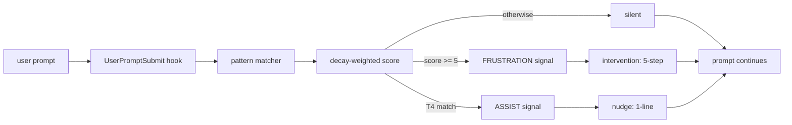

# frustration-check

> Originally documented in [CHANGELOG.md](../CHANGELOG.md) under v1.4.0 (skill introduction) and subsequent v1.4.x / v1.5.x / v1.6.x / v1.7.x refinements.

I built `frustration-check` because Claude Code treats every prompt the same, even when I've already said the same thing three times. The drift signal is in the conversation; nothing listens for it. I'd catch myself mid-session typing "I already told you" or "wtf" and realize I'd spent 40 minutes going in circles on a premise I'd silently decided to abandon two turns ago. Two failure modes kept repeating: fixating on a wrong initial premise and pushing Claude to make it work until the complexity became absurd, and riding Claude's stale training knowledge (a deprecated API, a changed library interface) because the feedback looked right and fast and neither of us stopped to check.

A skill you invoke manually can't help with either of those. By the time I remember to invoke it, I'm already too far in to think clearly. The fix needed to live on every prompt, score what I typed, and only surface when the evidence crossed a threshold. The product shape: a `UserPromptSubmit` hook runs tier-based regex matching and decay-weighted scoring; when the score meets or exceeds the threshold, the hook injects a signal that activates the `frustration-check` skill for a consent-gated intervention.

Built with Claude Code. The design spec at `docs/superpowers/specs/2026-04-22-frustration-check-skill-design.md` and the implementation plan at `docs/superpowers/plans/2026-04-22-frustration-check-skill.md` are preserved in the repo as part of the work record.

The prior art scan found one related thing: Claude Code ships a built-in regex-based frustration detector (`userPromptKeywords.ts`, surfaced in a March 2026 source leak). It modulates Claude's response tone. It does not trigger a workflow-level intervention. No community skill was found that performs the full "pause → calm → backfill context → realign intent" loop. This skill is the first of that shape.

---

## How it works

> All file:line references below are relative to `plugins/devTools/skills/frustration-check/scripts/` unless otherwise noted.

Four modules split the concerns: `patterns.py` owns the regex tier definitions, `scoring.py` owns the decay formula and threshold decision, `state.py` owns the per-session JSON load/save, and `detect_frustration.py` is the hook entrypoint that wires them together. Tests can import `patterns.py` and `scoring.py` directly without running a Claude Code session.

### Tier patterns

Four tiers of signal, defined in `scripts/patterns.py` (lines 21–48). Each tier targets a different behavioral class:

| Tier | Purpose | Weight |
|------|---------|--------|
| **T1** | Constraint repetition | 4 |
| **T2** | Rage / profanity | 3 |
| **T3** | Contradiction / halt | 2 |
| **T4** | Self-realization | — (mode marker only) |

The shipped patterns are case-insensitive and word-boundary aware:

**T1** (`patterns.py:21–27`):
```
\bi (already|just|literally) (told|said|asked|explained)\b
\bi made it clear\b
\bi never (wanted|said|asked)\b
\bhow many times\b
\b(again|still) (asking|telling|saying)\b
```

**T2** (`patterns.py:29–35`):
```
\bwtf\b
\bwhat the fuck\b
\bfucking\b
\bomfg\b
\bgoddamn\b
```

**T3** (`patterns.py:37–41`):
```
\bno[,.]?\s+(stop|not that|i said)\b
\bwhy are you still\b
\bstop (doing|trying)\b
```

**T4** (`patterns.py:43–48`):
```
\blet'?s?\s+step back\b
\bi'?m having doubt\b
\bmaybe (my|i) (was )?wrong\b
\bwhy hasn'?t\b
```

Calibration data from `docs/superpowers/specs/2026-04-22-frustration-check-skill-design.md` (§ Detection model): profanity appears at roughly 0.07% across ~5400 lines of real session transcripts. Near-zero "fuck/shit." T1 (constraint repetition) aligns with every real drift episode in the calibration set. That finding drives the weight assignments. T1 carries weight 4 because it's the dominant signal. The default threshold is 5 so a single T1 match scores 4 and doesn't fire; a T1 followed by a T2 clears threshold on the same prompt (score 7); two back-to-back T1 prompts fire on the second turn via decay.

This calibration also validates the explicit design decision to not include micro-correction phrases like "no wait" or "actually" in any tier. Those appear constantly in normal productive sessions and would produce constant false positives. The non-goals section of the design spec calls this out directly: "Detecting rapid micro-corrections — per explicit user feedback, Kevin optimizes Claude's output on the fly and doesn't want that pattern to trigger the hook."

T4 phrases need different treatment. "Let me step back" is already self-aware and calm. Scoring it and folding it into the frustration threshold would fire the heavy intervention exactly when the user doesn't need it. T4 bypasses scoring entirely and triggers a lighter "assist mode" offer instead.

All patterns live in `patterns.py`. Users can append custom patterns per tier via `custom_patterns` in `~/.ccToolBox/frustration-check/settings.json`, without touching the shipped code. `patterns.merge_custom()` (`patterns.py:55–65`) compiles base plus user patterns together before scoring. The `score_tiers()` function (`patterns.py:68–75`) calls `merge_custom()` for all four tiers on each invocation, so custom patterns take effect without a restart. Note that `score_tiers()` returns `(t1_count, t2_count, t3_count, t4_bool)` — T4 is a presence flag, not a count, because a single self-realization phrase is sufficient to trigger assist mode regardless of how many matched.

### Decay-weighted scoring

`scripts/scoring.py` (lines 21–44) applies the formula on every `UserPromptSubmit`:

```
score = prior_score × decay          # default decay = 0.5
score += (T1_count × 4) + (T2_count × 3) + (T3_count × 2)

if score >= threshold:               # default threshold = 5
    emit FRUSTRATION signal
    score = 0                        # reset to prevent immediate re-trigger
elif T4 matched:
    emit ASSIST signal               # score unchanged
else:
    silent no-op
```

Concrete calibration examples from the design spec (§ Calibration examples):

| Prompt(s) | Scoring | Fires? |
|-----------|---------|--------|
| `"wtf are you... i already told you"` (one prompt) | T1(4) + T2(3) = 7 | FRUSTRATION |
| `"i told you"` then `"wtf"` next turn | 4, then (4×0.5)+3 = 5 | FRUSTRATION on turn 2 |
| `"let's step back, maybe my UX isn't clear"` | T4 match | ASSIST |
| isolated `"ugh"` | 0 | no trigger |
| single `"wtf"` alone | 3 | no trigger (under threshold 5) |
| `"also defer the steward agent, we want TTS to match pre-Hermes"` | 0 | no trigger (optimization) |
| `"why are you disabling capabilities?! session leak has nothing..."` + context buildup | T3(2) + prior decay | FRUSTRATION within 1–2 turns |

The threshold of 5 was chosen specifically so a single T2 match (weight 3) doesn't fire. Profanity alone (one "wtf") scores 3 and falls short. That's intentional. The calibration data showed ~0.07% profanity rate across ~5400 lines, almost all contextual rather than directed at Claude. Firing on isolated profanity would produce false positives on every session where I typed "wtf" at a build error in a terminal paste.

The decay constant (0.5) cuts stale signal in half each turn. Four prompts after a near-miss, the residual drops below 1. That prevents accumulation across a long calm stretch while still letting two-turn patterns fire.

The score resets to 0 on a FRUSTRATION trigger (`scoring.py:41`). Without the reset, the next prompt would start at a high decayed value and the second intervention would fire almost immediately. The reset gives the user a clean slate after the intervention runs.

The `decide()` function returns a `score_before_reset` field alongside the mode and the new score. The hook uses this to include the pre-reset value in the emitted signal — `_emit_frustration()` is defined at `detect_frustration.py:76–80` and called at line 132: `FRUSTRATION signal (score=7.0)`. That number is visible to Claude when the skill activates, which in principle lets the skill calibrate the severity of its opening line. The skill doesn't currently use it, but the field is there for future refinement.

### Corruption-safe session state

State lives at `~/.ccToolBox/frustration-check/state/<session_id>.json` with schema `{ "score": float, "last_turn": int }`. Load and save are in `scripts/state.py`.

The load path (`state.py:26–38`) returns defaults on any failure:

```python
except (json.JSONDecodeError, OSError, ValueError, TypeError) as exc:
    print(f"[frustration-check] state file corrupt at {p}: {exc}", file=sys.stderr)
    return dict(DEFAULTS)
```

The save path (`state.py:41–48`) swallows `OSError` to stderr only:

```python
except OSError as exc:
    print(f"[frustration-check] failed to save state at {p}: {exc}", file=sys.stderr)
```

The contract, stated verbatim in `scripts/state.py:8`: "Never raises on corruption — frustration-check must not break prompt submit." `detect_frustration.py:13` repeats it from the hook's outer wrapper: "Hook must never crash prompt submission. All exceptions are caught at the outer boundary; on any error, exit 0 with empty stdout and a stderr warning."

Both sides of that contract matter. The state side refuses to raise. The hook side wraps `_main()` in an `except Exception` catch-all (`detect_frustration.py:142–145`) and exits 0 on any unhandled error. A corrupt state file degrades gracefully (score treated as 0, warning to stderr). A disk-full error on save degrades gracefully (silently skips the write). Neither case aborts the user's prompt.

Opportunistic garbage collection runs at the start of each hook invocation (`detect_frustration.py:110–111`). Files older than `state_ttl_days` (default 7 days) are deleted by `state.gc_stale()` (`state.py:51–66`). The cleanup is best-effort; any `OSError` during GC is silently swallowed.

### Defensive imports and SessionStart migration

Sibling modules are imported inside a `try/except` at `detect_frustration.py:30–36`:

```python
_IMPORT_ERROR: Exception | None = None
try:
    import patterns
    import scoring
    import state as state_mod
except Exception as exc:
    _IMPORT_ERROR = exc
```

If any import fails, `_IMPORT_ERROR` holds the exception. The `main()` entry point (`detect_frustration.py:138–146`) checks it before calling `_main()`:

```python
def main() -> int:
    if _IMPORT_ERROR is not None:
        _log(f"sibling module import failed ({_IMPORT_ERROR}); hook disabled for this invocation")
        return 0
```

A broken `patterns.py` (syntax error from a bad custom pattern, for example) disables the hook for that invocation without showing anything to the user. The prompt continues.

Settings migration runs at session start, not at hook invocation. The `SessionStart` hook calls `init_settings.py` on every session start (CHANGELOG v1.4.1). Previously the settings file was only created when someone ran the init script manually, so users who never tripped the threshold had no visible file to customize. The `SessionStart` hook fixes that.

`init_settings.py` handles five branches in order (`init_settings.py:95–122`): first-run file creation, malformed-file backup and reset, version-upward migration (merge preserving user customizations), version-newer warning, and same-version no-op. The migration path (`init_settings.py:63–84`) backs up the old file to `settings.json.v<old_version>.bak` before writing the merged result. The `SessionStart` hook is idempotent and silent on stdout, so it adds no context overhead.

---

## Tradeoffs and hard parts

### Why a hook, not a skill

Skills need the user to invoke them. Command discoverability is a feature when the user knows what they want. Here the whole problem is that I don't realize I need the intervention until I'm already deep in a bad pattern. The `UserPromptSubmit` hook runs on every prompt with no user action. It's invisible until it fires.

A manually invoked skill would cover the T4 self-realization case, where the user already knows they want to step back. It would miss every T1/T2/T3 episode. Those are the episodes that actually need intervention. The hook is the only mechanism that can catch them.

The tradeoff: hooks run unconditionally. A slow hook degrades every interaction. That's why the latency budget is strict and the detection stays lexical rather than semantic. Fast enough to be on every prompt, targeted enough to have a low false-positive rate.

### Why regex, not embeddings

Every user prompt passes through the hook. The scoring call has to return before Claude starts answering. Running an embedding model or a classifier on every prompt adds latency to every interaction, and the signal being detected is lexical, not semantic. "I already explained this" and "I made it clear" carry similar intent; both are in T1. Regex with word boundaries catches these phrases at zero marginal latency. An embedding model would classify the same phrases correctly at roughly 200ms overhead per prompt. On a 300-prompt working session, that's a minute of aggregate latency for no accuracy gain over the lexical approach.

The design spec notes this explicitly: "Sentiment analysis on every prompt (too expensive, too noisy)" is a non-goal. The lexical approach also has a practical benefit: the pattern list is auditable. A user who wants to understand why the hook fired can read `patterns.py` directly. A classifier's decision boundary is opaque.

### Why consent-gated, not auto-injected

The intervention injects a signal into the conversation context. The skill that responds offers three paths and waits for the user to pick one before doing anything. It does not automatically run drift scans or websearches.

The auto-injected alternative: hook fires, skill fires, Claude immediately recaps the last 10 turns and runs two websearches. That burns tokens and interrupts the session whether the user wanted it or not. Path (c) in the intervention ("push on, I was venting") exists because venting is a real and common case. Running expensive research before asking produces false positives that cost more than they save.

The three paths are:

- **(a) Drift scan.** Identify which turn diverged from a stated constraint and name the constraint. No external tool calls needed; the context is already in Claude's window.
- **(b) Knowledge-gap check.** Propose 1–3 specific websearch or context7 lookups (named library, named API, named question). The skill must name the specific query, not suggest "you might want to research X."
- **(c) Push on.** The user was venting. Path is fine.

An intervention that acts without permission is itself a kind of drift. It imposes structure the user didn't ask for. The consent gate also keeps the token cost low: a user who picks path (c) spends roughly 50 tokens on the intervention. A user who picks path (b) might spend 2000 tokens on a knowledge-gap research pass. That's the right tradeoff when the research is actually warranted. It's the wrong tradeoff when the user was just venting and the session was fine.

### Why per-session state, not cross-session

State files are keyed by `session_id`. Score resets to zero after a FRUSTRATION signal fires, and files older than 7 days are garbage-collected. Nothing carries over between sessions.

Cross-session state would accumulate a prior score based on yesterday's session. A session where I typed "wtf" twice yesterday would inflate the starting score today, even if today's session is going fine. Drift is a within-conversation pattern. The decay constant handles normal prompt-to-prompt falloff inside a session; the session boundary handles the rest.

The 7-day TTL exists to prevent unbounded state growth on disk, not for behavioral reasons. A session that was abandoned mid-score doesn't need to haunt the calibration a week later. `state.gc_stale()` runs opportunistically at hook start, so there's no separate cron needed.

Two opt-out mechanisms exist for users who want less intervention. Set `"enabled": false` in `~/.ccToolBox/frustration-check/settings.json` to disable the hook entirely. Or include the substring `skip frustration-check` anywhere in a prompt for single-turn suppression without altering accumulated state (`detect_frustration.py:101–102`). The single-turn suppression is useful when a prompt legitimately contains T1/T2/T3 patterns but the user knows the context doesn't call for intervention.

---

## What's next

Three open questions from the original design spec remain unresolved.

Cross-session correlation is a possible opt-in feature: track session-level FRUSTRATION trigger counts over time and surface them in a weekly summary, without feeding those counts into per-session scoring. The aggregation would be purely observational. You'd see "this week: 4 FRUSTRATION triggers, 2 ASSIST triggers" without those numbers biasing the next session's threshold. It isn't done yet because the cross-session-state-bias risk (stale counts inflating the next session's sensitivity) is exactly the problem the per-session design was built to avoid, and an opt-in aggregation layer adds that complexity back without a clear trigger for when to ship it.

The decay constant (0.5) is fixed. It may need to adapt to session length. A 200-prompt session and a 20-prompt session have very different "turn 2" semantics, and the same constant treats them identically. A long session's "stale" signal decays at the same rate as a short session's, which means drift accumulated over 100 prompts fades at the same absolute rate as drift accumulated over 10. One option: make decay a function of session length or time elapsed rather than a flat constant. This is deferred because a variable decay complicates calibration and makes the threshold harder to reason about; the fixed 0.5 captures the dominant case well enough that no real session has produced a miscalibrated trigger.

T4 self-realization phrases currently trigger the light "assist mode" offer. The open question is whether they should also auto-trigger `recall-test-knowledge` in testing contexts. "Let me step back" in a test-writing session often means a test strategy assumption has rotted. The `recall-test-knowledge` skill is already built to surface relevant entries from `testing-knowledge.md`. Wiring T4 to it in testing context would be one integration point, though it would require context-awareness the current hook doesn't have. The deeper reason it isn't wired up: T4 is a calm-already-decompressing signal, and auto-triggering a knowledge lookup at that moment pushes tokens at exactly the wrong time — the user is already stepping back and doesn't need the intervention amplified.

---

## Hook lifecycle

The full path from user prompt to prompt-continues in one diagram:


