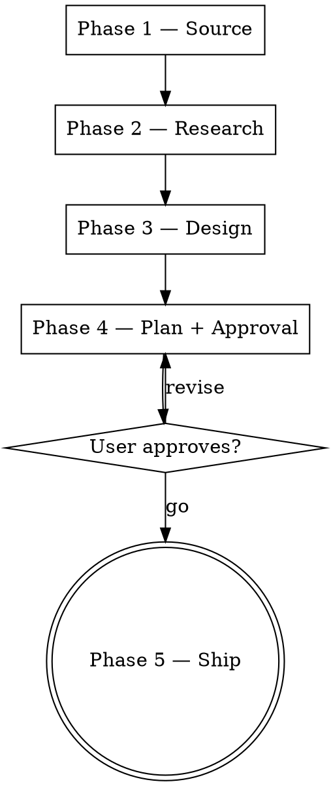

# skill-distill — Promote a Great Session into a Skill

When a session goes really well — a multi-turn build / debug / design
loop with non-obvious decisions, course-corrections, and a strong
result — that conversation is a working specification for a skill. This
skill turns the conversation into a Skill.

The output is a self-contained skill directory the user (or anyone)
can run later, not a memory note. The flow mirrors `ui-refinement`'s
five-phase shape so the experience is familiar: define → research →
design → plan → ship.

## When this beats writing a skill by hand

- The just-finished session contains the **magic** — specific prompt
  framings, persona corrections, scope guards — that you'd lose to the
  context window if you don't capture it now.
- The work is **repeatable** across other projects / platforms / scopes
  with similar structure.
- The user wants a **slash-invocable** entry point (`/foo`) and they
  want it generalized, not hard-coded to the source project.

## When NOT to use

- Tiny one-off ("save this snippet") — write a memory note or commit a
  doc.
- The session is mid-flight and not yet successful — wait until it
  works, then distill.
- The output should be a hook / setting / config, not a skill — point
  the user at `update-config` instead.

## Anti-pattern: writing without reading

If you find yourself drafting SKILL.md before you've actually read the
source session, **stop**. The whole value is faithful extraction. Read
the transcript / summary first, build the magic-ingredients list, only
then write.

## Flow at a glance



One TodoWrite item per phase.

---

## Phase 1 — Source

Output: an extracted **magic-ingredients list** + **success summary**
the user has reviewed.

### 1.1 — Pick the source

Ask the user via `AskUserQuestion`, multiple-choice:

- **Current session** — default. Read the active transcript file.
- **Other transcript** — user supplies the path.
- **Free-text summary** — user describes what worked in their own
  words.

For **current session**: locate the transcript at
`~/.claude/projects/<encoded-project-path>/<session-id>.jsonl`. The
encoded project path replaces `/` with `-` (e.g.
`/Users/foo/dev/sentient` → `-Users-foo-dev-sentient`). Glob:
`~/.claude/projects/*/*.jsonl` and pick the most recently modified one,
confirming with the user before reading.

For **other transcript**: `Read` the supplied path. JSONL: one
message per line, `type: user | assistant | system`.

For **free-text summary**: skip transcript; the summary IS the
distillation source.

### 1.2 — Extract the magic (subagent)

**Dispatch one `Agent` subagent** (`subagent_type: "general-purpose"`)
to read the source and return the magic-ingredients list. Transcripts
are large; offloading the read keeps the main context lean.

Hand the subagent:

- The source path (or the free-text summary verbatim).
- `references/distill-method.md` — the three-lens method.
- Instruction: "Read the source, apply the three lenses (user-prompt
  patterns / agent decisions that paid off / course-corrections from
  user pushback), and return a numbered list of 8–12 one-line rules.
  Quote load-bearing user phrasing verbatim where possible. Do NOT
  draft any SKILL.md content — only the ingredients list."

When it returns, show the list to the user; ask "anything missing or
mis-stated?" before continuing. The user's edits to this list are
the spec for everything downstream.

### 1.3 — Define the skill's mission

In one sentence: what problem does the skill solve, for whom, on what
input. Plus three concrete trigger phrases the skill should fire on,
and three near-miss phrases it should *not* fire on. This becomes the
SKILL.md description draft.

---

## Phase 2 — Research

Output: a short note recording (a) prior art on the skill's domain,
(b) Claude Code skill-format requirements, (c) target-destination
conventions.

**Dispatch 2.1 and 2.3 as parallel subagents** (single message, two
`Agent` tool calls — `subagent_type: "general-purpose"`). They are
independent: one does web research, the other inspects the local
filesystem. Phase 2.2 stays in the main agent because the format
rules need to be loaded for Phase 3 anyway.

### 2.1 — Prior art (subagent)

Hand the subagent:

- The skill mission from Phase 1.3.
- The magic-ingredients list from Phase 1.2.
- Instruction: "Use `WebSearch` to find 2–4 authoritative sources on
  this skill's problem domain — established naming conventions,
  workflows, failure modes. Search recent (current-year) posts:
  Anthropic docs, dev blogs, Claude-skill marketplaces. Return a
  short summary: what's established, what's worth borrowing, what's
  worth avoiding. Do NOT copy whole patterns — extract load-bearing
  ideas only."

### 2.2 — Claude Code skill format (main agent)

Read `references/claude-code-skill-format.md`. The hard rules:

- Frontmatter `name`: lowercase + hyphen + numbers only, ≤64 chars,
  no reserved words (`anthropic`, `claude`).
- Frontmatter `description`: ≤1024 chars, formula = *what it does +
  when to use it + key capabilities*. Description is the trigger;
  everything else is detail.
- Body ≤500 lines (split into supporting files for anything longer —
  progressive disclosure).
- Optional `tools:` allowlist — list only what the skill actually
  needs.

### 2.3 — Destination conventions (subagent)

Hand the subagent:

- The current working directory.
- `references/destination-conventions.md`.
- Instruction: "Probe the cwd and `~/.claude/` to determine
  destination options. Return: (a) is the cwd a marketplace,
  single-plugin repo, or plain repo? (b) what `.claude/skills/`
  paths exist at user level and repo level? (c) recommendation order
  with one-line rationale per option (user / repo / custom). Do NOT
  ask the user — only research."

When both subagents return, fold their outputs into the Phase 3
design pass. If either flags a blocker (e.g. cwd looks like a
read-only path), surface it before continuing.

---

## Phase 3 — Design

Output: a complete skill skeleton in working memory (not yet written
to disk). Use `templates/skill-design.md` as the shape.

### 3.1 — Name + description

Apply Phase 2.2's hard rules. The description is the most important
field; iterate it until it answers:

- **What** the skill does in one phrase.
- **When** to invoke it — both positive triggers and explicit "do not
  trigger on" near-misses (lifted from Phase 1.3).
- **Key capabilities** in one short clause.

Read `checklists/skill-quality.md` and self-grade the description.

### 3.2 — File layout

Pattern recommended for non-trivial skills:

```
<skill-name>/
├── SKILL.md                         # main flow, ≤500 lines
├── references/<topic>.md            # progressive-disclosure detail docs
├── personas/<role>.md               # mindsets the skill adopts in specific phases
├── checklists/<aspect>.md           # discipline lists for each pass
├── templates/<artifact>.md          # plan / output shapes presented to user
└── scripts/<helper>.{sh,py}         # only if the skill needs imperative work
```

Trivial skills can be a single `SKILL.md`. Bias toward extra files when
content exceeds 500 lines or when one chunk is reusable across phases.

### 3.3 — Generalize

Walk these axes; for each, write the skill's behavior:

- **Platform** — does the skill run only on web / iOS / Android /
  desktop / language-agnostic?
- **Project** — source-project specific or any compatible repo?
- **Input shape** — what variations of the trigger should it handle?
- **Output shape** — file edits, commits, written reports, runtime
  side effects?

Encode the magic ingredients (Phase 1.2) as inline rules in SKILL.md.
Numbered `Magic ingredients` section near the end works well.

### 3.4 — Pick a destination recommendation

Based on Phase 2.3, recommend one of: user / repo / custom. Reasoning:

- **User-level** — skill is broadly useful across many of the user's
  projects, no shared marketplace.
- **Repo-level** — skill is project-bound (uses project-specific
  paths, conventions, fixtures).
- **Custom path** — user maintains a plugin marketplace / shared skill
  repo and wants this committed there.

The user picks for real in Phase 4. This is just the recommendation
to lead with.

---

## Phase 4 — Plan + Approval

Output: a written plan the user has approved. Use
`templates/skill-design.md` as the shape.

### 4.1 — Present the plan

Show:

1. **Skill name + description** (frontmatter draft).
2. **Magic-ingredients list** (numbered, ≤12 items).
3. **File tree** with one-line purpose per file.
4. **Generalization summary** (platform / project / input / output).
5. **Destination recommendation** with one-line rationale.

Concise — one screen.

### 4.2 — Ask destination via AskUserQuestion

Multiple-choice:

- **user** — `~/.claude/skills/<name>/`
- **repo** — `<current-project>/.claude/skills/<name>/`
- **custom** — supply a path

If **custom**: ask for the path. Probe it (Phase 2.3 detection
results). If marketplace: ask which plugin to add to. If single-plugin:
confirm. If plain repo: confirm preferred subdir (default
`.claude/skills/`).

### 4.3 — Get explicit go

`AskUserQuestion` with `go` / `revise <what>` / `stop`. Don't write
files until `go`.

---

## Phase 5 — Ship

Output: a committed skill on disk at the chosen destination.

### 5.1 — Write the files

Order:

1. `SKILL.md` (main spec).
2. Supporting files in `references/`, `personas/`, `checklists/`,
   `templates/`, `scripts/`.
3. Verify the body is ≤500 lines; if not, refactor into supporting
   files.

Use `Write` for new files, `Edit` for any modifications mid-pass. Never
overwrite an existing skill without explicit user confirmation.

### 5.2 — Bookkeeping (destination-dependent)

**user-level** → done after Step 5.1. No bookkeeping.

**repo-level** → ensure the project's `.claude/` is git-tracked. No
version bumps required.

**custom — marketplace** → in lockstep:

1. Bump the chosen plugin's `version` in
   `plugins/<plugin>/.claude-plugin/plugin.json`. Use semver: minor for
   new skill, patch for fix-only.
2. Bump the same version in
   `.claude-plugin/marketplace.json`'s plugin entry.
3. Add a new top section to `plugins/<plugin>/CHANGELOG.md` matching
   the new version + today's date + a 1-paragraph summary lifted from
   Phase 1.3 mission + Phase 1.2 ingredients.
4. Add a new section to `plugins/<plugin>/README.md` under `## Skills`,
   describing the skill, trigger phrases, and platform support if
   relevant.

**custom — single-plugin** → like marketplace minus the
`marketplace.json` step.

**custom — plain repo** → write files only; ask user how they want it
committed (or skip commit).

### 5.3 — Commit

If the destination is a git repo, compose a commit message:

```
feat(<scope>): add <skill-name> skill

<one-paragraph distillation of source — what session inspired this,
what problem it solves, what the magic ingredients are>

<list of files shipped>

Co-Authored-By: Claude <noreply@anthropic.com>
```

Use the project's existing convention if visible (read recent commit
log first). Run lint / format / typecheck if the project has them and
they apply to the touched files (rare for prose-only skill changes).

Stage the relevant files explicitly — don't `git add -A`. Confirm the
commit with the user before pushing; the user pushes themselves unless
they explicitly ask the skill to push.

### 5.4 — Confirmation

Surface the result:

- Path to the skill.
- File tree.
- Commit SHA + branch (if applicable).
- Trigger phrase the user can try in a fresh session.
- Anything intentionally **not** included (out of scope, deferred for
  v2, requires another tool).

---

## Magic ingredients (encode in your behavior)

These are the meta-patterns from successful skill-distillation runs.
Re-read at the start of every Phase 1 pass:

1. **Read before you write.** Source session first; SKILL.md last.
2. **The user's prompt is half the magic.** Extract the framings, not
   just the agent's output.
3. **Course-corrections are bright lines.** Every pushback in the
   source becomes a rule the next agent must respect.
4. **Subagent the heavy reads.** Transcript extraction (Phase 1.2),
   prior-art search (Phase 2.1), and destination probing (Phase 2.3)
   all dispatch to subagents — large reads stay out of the main
   context. Run 2.1 and 2.3 in parallel.
5. **Web-search prior art.** Established naming, established
   workflows, established failure modes — borrow, don't reinvent.
6. **Inspect destination conventions before writing.** Marketplace
   shape, plugin layout, version semantics — match them in lockstep.
7. **Generalize across platforms / projects / inputs.** A skill that
   works only for the source project is a snippet, not a skill.
8. **Description is the trigger.** Spend disproportionate time on the
   description; the body is read after the skill fires.
9. **Show plan, then write.** Always present the skeleton before
   touching disk.
10. **Bookkeeping in lockstep.** Plugin version + marketplace +
    CHANGELOG + README in one commit, never partial.
11. **Commit message records the distillation.** What session
    inspired this, what magic it captured.

---

## Files in this skill

- `references/claude-code-skill-format.md` — frontmatter rules, dir
  layout, naming constraints.
- `references/distill-method.md` — how to extract magic from prompts /
  outputs / corrections.
- `references/destination-conventions.md` — user / repo / custom-path
  detection + bookkeeping.
- `personas/skill-author.md` — skill-writing rules (voice, layout,
  trade-off, attribution, self-check).
- `checklists/skill-quality.md` — pre-ship quality bar.
- `templates/skill-design.md` — Phase 4 plan shape.
