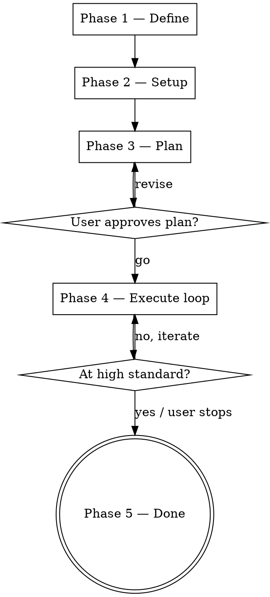

# ui-refinement — Visual Iteration on a Live Stack

A generalized, autonomous UI/UX refinement skill. The model drives a real
browser (or simulator) via MCP to **see** what it ships, critiques it
through fixed personas, implements fixes, and regression-checks every
pass. The magic is the live-inspection feedback loop — give a strong
model freedom to look, judge, and iterate, and the result lands far
above what static prompt-engineering can produce.

This skill operates on the **user's target project**, not on ccToolBox.
All script paths are relative to this skill directory; all output paths
(branches, commits, screenshots) are relative to the target project root.

## When this beats a one-shot edit

- The change is **visual** (spacing, density, hierarchy, alignment, motion
  sense) — text-only diffs miss the rendered truth.
- There are **multiple viewports / form factors** (mobile + desktop,
  portrait + landscape, light + dark) that need to stay in sync.
- The user lists symptoms but the **real fix surface is wider** than the
  list implies.
- The work needs to **respect a design system** that the model can drift
  from if left unchecked.

## When NOT to use this skill

- Single trivial CSS edit ("make this red") — just edit.
- Pure logic / state / data-flow bug — use `superpowers:debugging`.
- Architecture / refactor work without a visual surface.
- The app can't be brought up live (no stack, no test data) — fix that
  first or use static-mockup mode (out of scope for v1).

## Anti-pattern: theoretical critique

If you find yourself writing "I think the bubble is too wide" or "this
might feel cramped on mobile" — **stop**. Open the browser, take the
screenshot, look at it, then write the critique with the bbox + the
exact pixel values you measured. No live inspection, no critique.

## Flow at a glance



The skill is one TodoWrite item per phase; Phase 4 nests one TodoWrite
item per iteration pass.

---

## Phase 1 — Define

Output of this phase: a one-paragraph **brief** the user has signed off
on, plus an explicit **design-system guardrail**.

### 1.1 — Identify targets

Ask the user, one question at a time, the smallest set of unknowns:

- Which screen(s) / component(s)? (e.g. "chat view on mobile", "settings
  → secrets pane", "wizard step 2")
- Form factors? (phone / tablet / desktop / all; light / dark; specific
  device profiles like "iPhone SE 320px")
- Is this scoped to one feature or the whole app?

Use `AskUserQuestion`, multiple choice when possible. Do **not** start
inspecting yet.

### 1.2 — Optional design references

Ask: "Any references I should pull from? (Figma URL, competitor URL,
screenshot, design doc, internal design-system doc)"

If references provided:
- **Figma URL** → load `plugin:figma:figma-use` if available; otherwise
  fetch via `WebFetch` for any rendered preview.
- **Competitor URL** → `WebFetch` to see the rendered HTML hint, then
  visit live in the browser MCP for screenshot.
- **Screenshot** → user pastes; `Read` it.
- **Design-system doc** → `Read` and extract: token list (colors,
  spacing, type scale, radius), component patterns, motion language.

> **Industry references are inspiration, not gospel.** A user explicitly
> calling out "make it like ChatGPT" still wants to keep their own
> design language. When you cite an industry pattern, label it
> "inspiration" and check it against the project's design system before
> adopting.

### 1.3 — Success criteria + design-system guardrail

Write a brief like:

> **Target:** chat view on phones (≤620px viewport) and small tablets.
> **Goals:** tighten density, reduce empty space, fix the listed issues,
> find any others. **Design-system guardrail:** keep avatars, the
> meta-row pattern (name + time), the asymmetric "tail corner" bubble
> shape. **Out of scope:** desktop chat, settings, wizard.

Read `checklists/design-system-guard.md` and apply its discipline. The
guardrail is the bright line: any change that breaks it requires user
sign-off.

Confirm the brief with one sentence: "So: target X, goals Y, must-keep
Z. Proceed?" Wait for go.

---

## Phase 2 — Setup

Output: stack is **running locally**, the agent can drive it via an MCP,
the agent has the credentials needed to exercise the feature.

### 2.1 — Detect platform + pick MCP

Read `platforms/<platform>.md` for the matching environment:

- **Web** → `platforms/web.md` (Playwright MCP preferred; Chrome
  DevTools MCP fallback)
- **iOS / native mobile** → `platforms/ios.md` (ios-simulator MCP if
  installed; manual screenshot loop fallback)
- **Android** → `platforms/android.md`

> If no MCP is installed for the target platform, surface the gap to the
> user and stop. Do not continue with text-only critique — that
> defeats the entire skill.

Gate the deferred MCP tools via `ToolSearch` before any inspection. The
exact `select:` queries are in each `platforms/*.md`.

### 2.2 — Bring up the stack

The user owns this. Help by:

- Running `git status` and offering to commit / stash any uncommitted
  changes before branching.
- Detecting compose files / dev scripts (e.g. `deploy/docker/`,
  `package.json` `dev` script) and **proposing** the bringup command.
- **Never** start services or rebuild images without explicit user
  approval — the bringup might be slow, expensive, or stateful.

### 2.3 — Enumerate dependencies

Ask the user: "What does this feature need to actually run end-to-end?"
Common categories:

- **Provider / API tokens** — LLM keys, TTS keys, third-party APIs.
- **External services** — Home Assistant, internal APIs, databases.
- **Test data / fixtures** — accounts, seed data, sample content.
- **Environment** — host IPs, LAN routing, env vars.

> **Cost protection.** When the user provides credentials for paid
> services, confirm whether the skill should use them (some users
> withhold expensive keys deliberately so the loop stays free —
> e.g. "skip TTS, find a free LLM"). Honor that. Don't burn credit on
> design loops.

### 2.4 — Confirm cadence

Ask:
- **Branch?** Default: `feature/ui-refinement-<scope>` off the current
  branch. Confirm parent branch.
- **Commit cadence?** Default: commit each meaningful pass (one fix or
  cluster of related fixes per commit). Alternative: single batch at
  end (rare; ask before defaulting to it).
- **Push?** Default: hold pushes until end. Push only on explicit user
  ask.

---

## Phase 3 — Plan

Output: a written **iteration plan** (table + bullets, not prose) that
the user has approved. Use `templates/refinement-plan.md` as the shape.

The plan answers:

1. **Inspection matrix** — viewports × scenarios × bubble states. E.g.
   `390×844` (iPhone), `320×844` (iPhone SE), `768×1024` (iPad portrait),
   `1280×900` (desktop) × `empty / one bubble / multi-turn / tool-pill /
   markdown-heavy / streaming`.
2. **Test inputs** — actual content the agent will use to drive the
   feature (e.g. "Hi", "what's the weather tomorrow", "search news",
   "give me a 200-word recipe with markdown"). The agent has authority
   to invent more; user can pre-seed any specific edge cases.
3. **Initial issue list** — issues the user already noticed + any the
   agent already spotted in static review. Mark each as `confirmed` /
   `to-verify`.
4. **Regression scope** — which other surfaces must stay unaffected
   (e.g. "desktop chat unchanged", "settings panel unaffected").
5. **Done definition** — the agent's own bar. Default: "agent can no
   longer find any visual / interaction defect that violates the
   design-system guardrail or a checklist item, after a fresh
   walkthrough." User can replace with a more specific bar (e.g.
   "matches the Figma frame at 95%+").

Present the plan, ask "Proceed, revise, or stop?" via
`AskUserQuestion`. Wait for explicit approval.

---

## Phase 4 — Execute loop

Each iteration pass = one TodoWrite item. Use this structure:

### 4.1 — Capture baseline

Set the viewport (per platform's `browser_resize`-equivalent), navigate
to the target screen, drive any required state (login, fixture data,
trigger the UI state — empty / streaming / error / etc.), and capture
both:

- A screenshot (for visual critique)
- An accessibility snapshot or DOM inspection (for measurements:
  bounding boxes, computed styles, font sizes)

Save each baseline screenshot with a deterministic name
(`<scope>-<viewport>-<scenario>-baseline.png`) in the project's existing
screenshot dir if any, otherwise the playwright MCP default
(`.playwright-mcp/`).

### 4.2 — Critique through TWO personas

**Mandatory two-pass critique.** Read both:

- `personas/senior-designer.md` — alignment, sizing consistency, spacing
  rhythm, hierarchy, motion sense, density. The "would I ship this?"
  bar.
- `personas/ruthless-tester.md` — find what the user listed AND find
  what they missed. Edge cases (very short / very long content, error
  states, tap-target sizes, keyboard-open height, scroll boundaries).

Read `checklists/visual-critique.md` once and run the checklist on each
captured screenshot. For each finding, write:

- **What** — the defect, in one line.
- **Where** — selector or bbox.
- **Why it's a defect** — citing checklist or design-system rule.
- **Severity** — blocker / major / minor / nit.

Output the findings as a table. Don't classify into fixes yet.

### 4.3 — Plan the fix(es) for this pass

Pick a tight cluster (1–4 findings that share a fix surface — usually
one CSS block or one component). Don't bundle unrelated fixes.

Before editing, double-check **scope guard**:

- Does the fix risk affecting other viewports / surfaces?
- Does it use existing design tokens (spacing, font, color, radius)?
- Does it preserve the design-system guardrail from Phase 1?

If yes / yes / yes → proceed. If any "no" → either revise the fix or
escalate to the user with the trade-off in one sentence.

### 4.4 — Implement

Make the edits via `Edit` (preferred) or `Write`. Keep changes minimal
and inside the cluster. Don't refactor surrounding code.

If using a HMR-capable dev server (Vite, Next.js dev), the change is
live without rebuild. If the change is in baked-in / built code, decide
whether to rebuild (slow) or run a separate dev server in parallel.
Prefer the dev server for speed.

> **HMR sanity check.** If a CSS / TS change isn't visible after edit
> and reload, verify the dev server is actually picking up your file.
> Vite's HMR can silently serve a stale bundle if there's a worktree /
> path mismatch. Quick check: `curl -s <dev-url>/<path-to-file>` and
> grep for an identifier you just added.

### 4.5 — Re-capture + diff

Set the same viewport + scenario, screenshot, label `<scope>-<viewport>-
<scenario>-iter<N>.png`. Visually compare to baseline. Note explicitly:

- Did the targeted defect resolve?
- Any unintended changes (color shift, layout reflow, content
  truncation)?

### 4.6 — Regression-check unaffected viewports

For every viewport in the plan that the change *shouldn't* affect,
re-capture and eyeball-compare to baseline. The model's eyes are
unreliable for pixel-level diff but excellent for "did anything obvious
break."

If a regression is found → revert the offending change OR scope it
behind the right media query / platform check. **Do not ship a fix that
breaks an unaffected surface.**

### 4.7 — Commit the pass

If the pass succeeded (target fix applied, no regressions), commit using
the project's commit convention:

```
<type>(<scope>): <one-line summary>

<body — what changed and why, mention the specific defect resolved>
```

Use `superpowers:caveman-commit` if installed, otherwise compose the
message inline. Example:

```
feat(webui/chat): mobile UX pass

Tighten the chat surface for phone-width viewports (≤620px). Bubble
text 14px / line-height 1.5; padding 10×12; message-list gap 14px.
User-side meta + avatar retained per the existing design language.
Tool-pill names strip layered routing prefixes. Suggestion chips
horizontal-scroll. Composer blurs textarea after send on touch
devices.
```

### 4.8 — Re-critique or exit

After the commit, re-run Phase 4.2 (critique) on the latest state. The
agent's question to itself: "Looking at this fresh, is there still any
finding I'd flag from the senior-designer or ruthless-tester pass?"

- **Yes** → next iteration pass.
- **No** → propose exit to the user with the summary from Phase 5.

If the user has been silent and the loop has run > 5 passes, **check
in** anyway: "Pass 5 done. I think we're at the bar — want me to keep
looking or wrap up?"

---

## Phase 5 — Done

Output: a one-screen recap.

- Branch: `<name>` (N commits ahead of `<parent>`)
- Commits (oldest first): `<oneline>` × N
- Before/after summary, two columns:
  - **Before:** the listed defects + density measurement (e.g. "list
    gap 24px, bubble 15px / 1.6").
  - **After:** the resolved state + new measurement.
- Anything intentionally **not** fixed (out of scope, blocked by
  upstream, requires user sign-off) — list with reasons.
- Recommended next steps: push branch / open PR / additional scope to
  refine separately.

---

## Course-correction protocol

The user will sometimes push back on a fix mid-loop ("don't hide the
avatar, that's our design language"). When this happens:

1. **Revert the change immediately** (or stage a fix-up commit) — don't
   argue.
2. **Update the design-system guardrail** in your own working notes:
   add the constraint the user just clarified. Future passes must
   respect it.
3. **One-sentence acknowledgment**: "Restoring avatar + meta. Future
   passes will tighten density without dropping them."
4. **Continue the loop** — don't stop the whole skill, just adjust the
   scope guard.

The user's clarifications are the single source of truth for design
language. Industry references and the agent's own taste come second.

## Magic ingredients (encode in your behavior)

These are the success patterns from real ui-refinement runs. Re-read
them at the start of every Phase 4 pass:

1. **Live inspection only.** No critique without a fresh screenshot.
2. **Find more than the list.** The user-listed defects are a seed,
   not a cap. The ruthless-tester persona's job is to find what they
   missed.
3. **Industry refs are inspiration, not gospel.** Cite them, then
   filter through the design-system guardrail.
4. **Both viewports, every pass.** Regression catches matter more than
   theoretical correctness.
5. **Real running stack, real data.** Mocked state lies. Drive the
   actual feature with realistic content.
6. **Cost protection.** If the user said "skip TTS / use free
   models", honor it forever in the session.
7. **Senior-designer + ruthless-tester, both.** Each catches what the
   other misses.
8. **Scope-guard every edit.** If a fix could affect another surface,
   either gate it via media query / feature flag / platform check, or
   escalate to the user.
9. **Commit each meaningful pass.** Lost work in the middle of a
   refinement loop is the worst outcome.
10. **Exit on quality bar, not iteration count.** Stop when the agent
    can no longer find a finding, not when N passes are done.

---

## Files in this skill

- `personas/senior-designer.md` — critique mindset
- `personas/ruthless-tester.md` — find-more discipline
- `platforms/web.md` — web inspection (Playwright / Chrome DevTools MCP)
- `platforms/ios.md` — iOS simulator inspection
- `platforms/android.md` — Android inspection
- `checklists/visual-critique.md` — 12-point visual checklist
- `checklists/design-system-guard.md` — drift-prevention discipline
- `templates/refinement-plan.md` — Phase 3 plan shape
